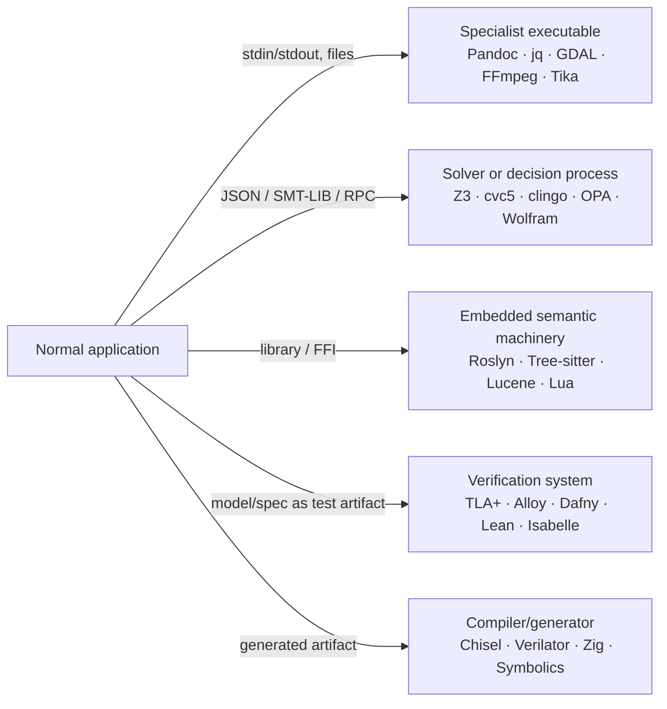

# Crossing-Cost Advantage Atlas: Where Specialist Ecosystems Actually Earn the Boundary

## Executive summary

The strongest result of this second pass is that the useful unit of analysis is **not the programming language**. It is the **computational capability plus the cheapest boundary at which that capability can be borrowed**.

A surprisingly large fraction of genuine asymmetric advantages do **not** require adopting another language as the application's language. They are accessible as a CLI, JSON-speaking process, solver API, generated artifact, embedded library, or verification sidecar. Pandoc, GDAL, FFmpeg, Z3/cvc5, MiniZinc, clingo, OPA, Wolfram Engine, Tika and Verilator all fit this pattern to varying degrees. That gives a better decision rule than “language X is good at Y”:

> **Cross an ecosystem boundary when it deletes a subsystem, gives access to semantics you would otherwise have to recreate, turns search into specification, or materially reduces correctness risk—and capture that advantage at the narrowest stable interface.**

The research found four particularly important kinds of asymmetry.

**Semantic machinery you should almost never rebuild:** Roslyn for actual C# semantics; Tree-sitter for incremental, error-tolerant syntax trees; Redex for executable operational semantics; Lean/Rocq/Isabelle for machine-checked proofs; Z3/cvc5 for SMT; TLA+ for state-machine exploration; Alloy for relational model finding. These are not ordinary libraries with convenient helper functions. They provide *machinery corresponding to an entire discipline*. **Declarative search systems that can replace algorithms:** Soufflé can turn recursive Datalog into specialized parallel C++ for large static-analysis workloads; MiniZinc separates the constraint model from the solver; clingo provides answer-set/stable-model search with incremental grounding and solving; SWI-Prolog's CLP(FD) turns arithmetic relations into bidirectional constraints. These are especially valuable when the program you were about to write contains candidate generation, recursion, propagation, backtracking, fixed points or repeated hand-maintained work lists. **Specialist executables with absurdly favorable crossing costs:** Pandoc for structured document conversion, GDAL for geospatial formats and transformations, FFmpeg for media, jq for JSON transforms, and Tika for content extraction. Their important property is not merely capability but *boundary economics*: your C#/Python/Java/Rust/etc. application can simply invoke them and exchange files or structured data. **Systems where representation itself is the advantage:** CUE treats configuration values, schemas and constraints through the same unification model; Rego expresses policy decisions over arbitrary structured input; Julia/Symbolics makes symbolic expressions flow through ordinary Julia code and can regenerate compiled numerical functions; JAX treats differentiation, vectorization, compilation and sharding as transformations of numerical programs. These are the cases where merely finding an equivalent library in one's default language misses the point. Several initially expected candidates became **less** compelling under this criterion. There is no general “proof assistant winner”; Lean, Isabelle, Rocq and Agda optimize different workflows. JAX faces much stronger competition from modern PyTorch than older descriptions imply. Chisel is compelling for *hardware generators*, not automatically for all RTL. Zig's cross-compilation/C story can justify using Zig as a build/adapter layer without justifying a Zig rewrite. APL-family expressiveness remains intellectually distinctive, but this investigation did not establish a broad enough operational advantage to recommend paying an ecosystem-crossing cost merely for array notation. Those are important negative findings.

The topology that repeatedly emerges is:



The practical consequence is stronger than “be polyglot”:

> **Maintain a normal implementation ecosystem, but maintain a much larger mental catalog of things you are willing to call.**

That is the version of selective polyglotism this research supports.

## Compact lookup atlas

The table below is deliberately problem-first. “Boundary” means the cheapest sensible way to capture the advantage, not every integration mechanism the tool supports. “Cost” combines installation, conceptual learning and runtime/toolchain burden; it is qualitative.

| When the problem turns into… | Stop and consider… | Cheapest useful boundary | Cost | Strength of override |
|---|---|---:|---:|---|
| Proving mathematical/program propositions | **Lean 4** | Separate proof project / CI | Medium–High | Strong when proof is actually required |
| Large HOL formalization with mature automation | **Isabelle/HOL** | Separate proof project / CI | High | Strong in its niche |
| Existing Coq/Rocq proof ecosystem or dependent verification | **Rocq** | Separate proof project / extraction | High | Ecosystem-dependent |
| Concurrent/distributed protocol correctness | **TLA+ / PlusCal + TLC** | Spec + model-check CI job | Low–Medium | **Very strong** |
| Small-scope structural/relational counterexamples | **Alloy** | Spec + analyzer/model finder | Low–Medium | **Very strong** |
| Proving implementation code against contracts | **Dafny** | Verified component / generated target code | Medium | **Very strong** |
| Boolean/arithmetic/bit-vector/array theory reasoning | **Z3** | SMT-LIB process or host API | Low | **Very strong** |
| Independent SMT oracle / rich sequence theories / proofs | **cvc5** | SMT-LIB process | Low | Strong |
| Recursive whole-program static analysis | **Soufflé Datalog** | Facts in/out or generated executable | Medium | **Very strong** |
| Solver-independent scheduling/allocation/CP | **MiniZinc** | `.mzn` model + CLI/Python | Low–Medium | **Very strong** |
| Defaults, exceptions, combinatorial knowledge representation | **clingo / ASP** | Facts/model via CLI or API | Medium | **Very strong** |
| Relational search with partially known terms | **SWI-Prolog + CLP** | Separate Prolog process/module | Low–Medium | Strong |
| Bayesian reference modeling/inference | **Stan** | CmdStan process/files | Medium | Strong for suitable models |
| Transform numerical programs for AD/JIT/vectorization/accelerators | **JAX** | Python worker or own numerical subsystem | Medium | Conditional–strong |
| Symbolic → generated high-performance numerical code | **Julia Symbolics/SciML** | Julia worker or Julia subsystem | Medium | **Very strong** |
| Broad exact/symbolic CAS oracle | **Wolfram Engine** | `wolframscript` / process | Low technically; licensing variable | **Very strong pre-production** |
| Reproducible toolchain/build closure | **Nix** | `nix develop` / `nix build` around project | High learning, low runtime | Strong when reproducibility hurts |
| Policy shared among heterogeneous enforcement points | **OPA/Rego** | Local process, REST or embedded evaluator | Low–Medium | **Very strong** |
| Configuration + schema + defaults + constraints are colliding | **CUE** | `cue vet/export` CLI | Low–Medium | **Surprisingly strong** |
| Nontrivial JSON surgery in pipelines | **jq** | CLI stdin/stdout | **Very low** | Strong because cost ≈ zero |
| C# semantic/code analysis | **Roslyn** | Small .NET worker/library | Low if .NET available | **Extremely strong** |
| Incremental/error-tolerant multi-language syntax parsing | **Tree-sitter** | Native/Wasm binding | Low–Medium | **Extremely strong** |
| Experimenting with programming-language operational semantics | **Racket/Redex** | Separate model/test suite | Medium | **Extremely strong** |
| Heterogeneous document content extraction | **Apache Tika** | Tika app/server or tiny JVM/JBang wrapper | Low | **Extremely strong** |
| Embedded full-text/faceted/vector index | **Apache Lucene** | Small JVM library/service | Medium | **Very strong** |
| Documentation/markup dialect conversion | **Pandoc** | CLI files/stdin/stdout | **Very low** | **Extremely strong** |
| Application needs an embedded user scripting language | **Lua** | C API/FFI | Low | **Very strong** |
| Cross-compile or consume awkward C without adopting a huge native toolchain | **Zig** | Build/adapter layer | Low–Medium | Conditional |
| Parameterized/reusable hardware generation | **Chisel + FIRRTL/CIRCT** | Generated Verilog/SystemVerilog | High | Strong when hardware is generator-shaped |
| Fast executable simulation of Verilog/SystemVerilog | **Verilator** | Generated C++ executable | Medium | **Very strong** |
| Raster/vector geospatial format/reprojection plumbing | **GDAL** | CLI first; C/Python API if needed | Low | **Extremely strong** |
| Audio/video probing/transcoding/filter graphs | **FFmpeg** | `ffprobe`/`ffmpeg` subprocess | Low | **Extremely strong** |

This list is intentionally not “one row per language.” For instance, Haskell appears nowhere despite Pandoc being written in Haskell, because **Pandoc is the advantage, not Haskell adoption**. Pandoc explicitly presents itself as both a Haskell library and a command-line converter built around readers, an intermediate document AST and writers; from another ecosystem, the CLI is usually the economically correct boundary. ## Evidence-backed atlas

**Formal proof — Lean 4**

**Problem.** You need a proposition to be *proved by a small trusted kernel*, rather than empirically tested or boundedly searched. **Recommended ecosystem.** Lean 4, an open-source theorem prover and programming language whose official project describes uses in formalized mathematics, software verification, education and program synthesis. **Why asymmetric.** The advantage is not that Lean can check conditions; SMT solvers can do that automatically. It is that a potentially large, tactic-generated proof term is ultimately checked by a relatively small kernel, while the surrounding language supports constructing large formal developments. For greenfield mathematical formalization, Lean is therefore qualitatively different from tests, property tests and conventional static analysis. **Boundary and cost.** Keep proofs in a separate Lean project and make successful compilation part of CI. Do not FFI Lean into the application unless proof-producing integration is genuinely needed. Activation cost is moderate to high because the mathematical formalization is the work; installation itself is not the major cost. The ecosystem was visibly active in September 2026, with Lean 4.35 nightly artifacts appearing in late August and current packages targeting the contemporary Lean 4 line. **Minimal workflow.**

```lean
theorem add_zero (n : Nat) : n + 0 = n := by
  induction n with
  | zero => rfl
  | succ n ih => simp [ih]
```

The application need know nothing about Lean; CI merely requires the proof artifact to continue checking. **Limit.** Do not cross into Lean because “correctness is important.” Formal specification and proof incur real modeling cost, and automated SMT/model checking is much cheaper where the property falls into their decidable or bounded search regimes. **Formal proof with mature HOL automation — Isabelle/HOL**

**Problem.** You want interactive higher-order-logic proof with mature automation and a large corpus of formal developments. **Recommended ecosystem.** Isabelle/HOL. **Why asymmetric.** Isabelle is particularly attractive where its proof methods and existing Archive of Formal Proofs material align with the problem; it is less a generic programming-language crossing than entry into a long-lived formal-methods environment. The official release site lists Isabelle2025-2, released in January 2026, with current Linux, Windows and macOS distributions and a corresponding AFP release, showing continuing maintenance rather than a historical ecosystem frozen in place. **Boundary and cost.** A standalone Isabelle theory project checked in CI is the clean boundary. Cost is high enough that existing libraries and proof style should drive the choice. **Minimal workflow:** state a theorem in a `.thy` theory, use Isabelle's simplifier/automation, and require the session build to pass. **Limit.** There is no evidence-backed reason from this survey to choose Isabelle over Lean or Rocq for *every* new theorem-proving project; the asymmetry is the formal-proof substrate plus ecosystem, not universal dominance among proof assistants. **Dependent proof ecosystem — Rocq, formerly Coq**

**Problem.** You are extending a development already built around Coq/Rocq, its tactic/plugin ecosystem, or dependent proofs. **Recommended ecosystem.** Rocq. The Rocq Platform released 2025.08.2 in February 2026, and the standard library had a 9.2.0 release in July 2026, so this is an actively maintained system rather than merely the historically important “Coq” ecosystem. **Why asymmetric / boundary.** Existing verified libraries can make the ecosystem itself the unfair advantage: rewriting equivalent infrastructure in Lean or Isabelle destroys the reason for switching. Keep it as a separate proof/extraction project. Installation is easiest through Rocq Platform or opam according to current project documentation. **Minimal workflow:** define an inductive datatype, state a theorem, prove it using tactics and compile the project. **Limit.** For an unconstrained greenfield proof development, this investigation did not uncover evidence that Rocq categorically dominates Lean or Isabelle; existing formal assets are the strongest crossing trigger. **Concurrent/distributed-system exploration — TLA+ and PlusCal**

**Problem.** Your correctness question is about *states and behaviors*: races, retries, failover, ordering, leader election, duplicated messages, liveness or fairness. **Recommended ecosystem.** TLA+, often with PlusCal as a more algorithmic notation, and the TLC model checker. Lamport's official material explicitly positions PlusCal for concurrent and distributed algorithms and translates it to TLA+ for analysis; TLC explores models and supports safety/liveness checking. **Why asymmetric.** A conventional implementation forces you to pick implementation details before exploring the behavioral state space. TLA+ lets the model intentionally retain nondeterminism, then exhaustively explore a finite instance. That is a fundamentally different debugging instrument from unit tests. It is especially asymmetric for bugs whose essence is “some legal interleaving breaks an invariant.” **Boundary, cost, maturity.** The cheapest boundary is almost ideal: a `.tla` specification and model configuration live beside the code and run as a CI/test artifact; no production runtime dependency exists. Tool installation and basic modeling are modest; learning to model at the right abstraction level is the real cost. TLA+ has a substantial history of industrial and protocol case studies in its official literature. An exact current TLC version was not established by this research, so version pinning should be treated as a project setup detail rather than inferred here. **Minimal workflow.** Model a queue with nondeterministic producer/consumer steps, state `Len(queue) <= Capacity` as an invariant, ask TLC to search a small finite instance, and let it produce a concrete counterexample trace. **Limit.** TLA+ proves things about the model, not automatically about the correspondence between the model and implementation.

**Finite relational model finding — Alloy**

**Problem.** You have a structural question involving sets, relations, ownership, graphs, cardinality and invariants and want concrete counterexamples quickly. **Recommended ecosystem.** Alloy and its Kodkod-backed analyzer/model-finding machinery. Alloy's official backend documentation exposes the relational model finder as a reusable backend rather than treating it only as an IDE. **Why asymmetric.** TLA+ is behavior/state-sequence oriented; SMT is low-level and theory oriented; Alloy's sweet spot is compact relational structure with bounded instance generation. The payoff is often that an apparently reasonable schema invariant produces a *small concrete world that violates it*. **Boundary.** Keep an Alloy model beside the system design and run it in design/test workflows. **Activation.** Low to medium; learning its relational logic matters more than installation. **Minimal workflow:** model `User`, `Group` and membership relations; assert that an ownership rule prevents orphaned resources; ask for a counterexample within a small finite scope. **Limit.** Bounded analysis is not an unbounded proof merely because no counterexample exists in the chosen scope. **Code-level deductive verification — Dafny**

**Problem.** The property belongs directly to implementation code: array bounds, loop invariants, functional postconditions, representation invariants, or a verified algorithm you still want to compile into mainstream target languages. **Recommended ecosystem.** Dafny. It is explicitly a verification-aware language with specifications and a static verifier, and current documentation describes compilation targets including C#, Java, JavaScript, Go and Python. **Why asymmetric.** It occupies a valuable middle position between “model the system separately” and “formalize everything in an interactive proof assistant.” Contracts, invariants and proofs live adjacent to executable code, while the verifier discharges many obligations automatically. **Boundary.** Isolate critical algorithms in a Dafny module and compile/export them rather than rewriting an entire application. **Activation.** Medium: syntax is approachable to imperative programmers, but discovering adequate invariants can be difficult. Current official documentation and release snapshots remained active in 2026. **Minimal workflow.**

```dafny
method Abs(x: int) returns (r: int)
  ensures r >= 0
  ensures r == x || r == -x
{
  if x >= 0 { r := x; } else { r := -x; }
}
```

**Limit.** Verification can become specification engineering. For “find me a counterexample in this finite protocol,” TLA+/Alloy is usually the cheaper abstraction; for deep mathematical proof, a proof assistant is richer.

**General SMT — Z3, with cvc5 as an independent companion**

**Problem.** You have a decidable-ish logical core involving Booleans, arithmetic, bit-vectors, arrays, uninterpreted functions, datatypes or combinations thereof. **Recommended ecosystem.** Z3 as the default general-purpose SMT engine, and cvc5 when its theories/features fit better or when a genuinely independent solver is useful. Microsoft's official Z3 guide documents arithmetic, bit-vectors, Booleans, arrays, functions and datatypes; cvc5 describes itself as an open-source SMT theorem prover and ships binaries for the major desktop platforms. **Why asymmetric.** Once a problem maps cleanly into SMT, writing your own search is almost always the wrong abstraction. The solver supplies years of theory reasoning, propagation and search heuristics behind a tiny declarative interface. Z3 additionally exposes optimization/MaxSMT facilities; cvc5 has substantial sequence/string-theory support and proof-output work that can feed proof reconstruction systems such as Isabelle. **Boundary and cost.** The lowest-coupling interface is often **SMT-LIB over a subprocess**, not a language binding. It makes the solver replaceable and permits Z3/cvc5 differential checking. Direct APIs are appropriate when incremental solving is performance-critical. Installation is low; expressing the problem correctly is the main cost.

**Minimal workflow:**

```smt2
(declare-const x Int)
(declare-const y Int)
(assert (> x 10))
(assert (= y (* 2 x)))
(assert (< y 25))
(check-sat)
(get-model)
```

**Limit.** SMT does not magically make poorly chosen nonlinear/infinite formulations tractable. Solver success can be exquisitely sensitive to theory fragment and encoding.

**Recursive static/data-flow analysis — Soufflé Datalog**

**Problem.** Your analysis consists of relations repeatedly reaching a fixed point: call graphs, points-to, taint propagation, reachability, dependency closure or data-flow analysis over millions of facts. **Recommended ecosystem.** Soufflé. Its project explicitly targets “logic-defined static analysis,” citing Java points-to, taint and security analysis, and compiles logical rules into specialized parallel C++ with optimized data structures. **Why asymmetric.** In an imperative implementation you build work queues, indexes, deduplication, convergence logic and often parallelization. In Datalog, a transitive closure is essentially the mathematical relation:

```text
Reach(x,y) :- Edge(x,y).
Reach(x,z) :- Reach(x,y), Edge(y,z).
```

Soufflé turns that declaration into an executable analysis. This is the purest example found of **deleting an algorithmic subsystem by changing representation**. Its documentation includes compile mode, profiling, query-plan support and several input/output mechanisms including CSV and SQLite. **Boundary.** Export relations as facts, invoke Soufflé, read relations back—or compile the analysis into an executable. **Activation.** Medium: Datalog is small, but efficient relational modeling takes practice. **Limit.** It is not a substitute for a general programming language when stateful sequencing, arbitrary side effects or complex numerical computation dominate.

**Solver-independent constraint programming — MiniZinc**

**Problem.** Scheduling, packing, allocation, routing-like combinatorics or finite optimization where you want to describe the model without marrying it to one solver's API. **Recommended ecosystem.** MiniZinc. Current official documentation describes a high-level solver-independent constraint-modeling language, translation to FlatZinc, multiple solver backends, CLI/IDE support, automatic solution checking and Python/JavaScript interfaces. The current documented release is 2.10.1. **Why asymmetric.** The separation between **model** and **solver** is the advantage. Compared with directly expressing constraints through Gurobi, OR-Tools or a CP-SAT API, it becomes cheaper to try different backend technologies while leaving the model largely intact. **Boundary.** `.mzn` file plus JSON/data file and CLI is usually enough. **Activation.** Low to medium; binaries bundle useful solvers on mainstream platforms. The project's repositories were actively updated in September 2026. **Minimal workflow:**

```minizinc
var 1..9: x;
var 1..9: y;
constraint x != y;
constraint x + y == 10;
solve satisfy;
```

**Limit.** A specialized solver's native API can still win when its proprietary features, callbacks or performance tuning become central.

**Nonmonotonic/default-rule search — clingo / Answer Set Programming**

**Problem.** The domain is naturally rules plus alternatives, defaults, exclusions and combinatorial choices: planning, configuration, diagnosis, graph selections or knowledge representation where “absence of proof” can itself matter. **Recommended ecosystem.** Potassco's clingo, which combines grounding and solving and supports controlled/incremental grounding and solving. Current project material showed clingo 5.8.2 released August 14, 2026. **Why asymmetric.** ASP is not merely Prolog with different syntax. Stable-model semantics make it natural to say “choose candidate facts subject to these rules and defaults,” then obtain whole satisfying worlds. MiniZinc is often cleaner for predominantly arithmetic/global constraints; Prolog is often cleaner for goal-directed relational computation. clingo becomes unfair when the problem itself looks like a set of admissible worlds defined by rules. **Boundary.** Feed facts plus an ASP program to `clingo`; parse answer sets. **Activation.** Medium because the semantics are less familiar than imperative programming. **Minimal workflow:** declare possible assignments, constrain each resource to one owner, prohibit forbidden combinations, ask clingo to enumerate or optimize valid worlds. **Limit.** Do not use ASP merely because there is search; arithmetic-heavy industrial scheduling often belongs in CP/MIP instead.

**Relational computation with constraints — SWI-Prolog + CLP(FD)**

**Problem.** You keep writing operations that should sensibly run in several directions, with partially known structures and integer constraints. **Recommended ecosystem.** SWI-Prolog with CLP(FD). Its current documentation explicitly emphasizes that arithmetic constraints are *relations* usable with partially instantiated arguments and includes global combinatorial constraints such as `all_distinct`, `global_cardinality` and `cumulative`. **Why asymmetric.** `3 #= Y + 2` computes `Y = 1`; the same relationship is not forced into an input/output direction. Unification, backtracking and constraints compose directly. That representational shift can erase a lot of “generate candidate, inspect, recurse, undo” machinery. **Boundary.** Separate Prolog worker reading terms/JSON, or a tiny `.pl` program invoked from the host. **Activation.** Low technically and medium conceptually. **Minimal workflow:**

```prolog
:- use_module(library(clpfd)).

schedule(A, B) :-
    [A,B] ins 1..10,
    A #< B,
    A + B #= 11.
```

**Limit.** Goal order and termination still matter; CLP does not abolish operational behavior. Soufflé is generally the better fit for huge monotone fixed-point analyses, and MiniZinc for solver-oriented optimization. **Bayesian inference as an independent reference system — Stan**

**Problem.** You want a mature probabilistic model with HMC/NUTS-style Bayesian inference, particularly where a standalone implementation makes a useful independent reference against application code. **Recommended ecosystem.** Stan/CmdStan. Stan's official material describes a probabilistic language spanning simple regressions through hierarchical and time-series models. **Why asymmetric.** The main crossing advantage is *not* “Python can't do Bayesian statistics”—PyMC very much can, with a Python-native model, PyTensor and contemporary JAX/Numba backends. Rather, Stan gives you a separate modeling language and inference implementation that can act as an independent computational artifact. PyMC's current documentation identifies version 6.3.2 and provides NUTS/HMC in a deeply Python-native environment, so Python users should not switch merely for convenience. **Boundary.** CmdStan through data/result files or an official language interface. **Activation.** Medium because model geometry and diagnostics matter more than syntax. **Minimal workflow:** specify a simple hierarchical model, feed JSON/data, run multiple chains, consume posterior draws in the host system. **Limit.** When your probabilistic model must directly compose with a Julia numerical model, Turing's Julia integration may be a better shape; when Python integration dominates, PyMC removes a boundary. **Composable numerical transformations — JAX**

**Problem.** You need to differentiate, JIT-compile, vectorize and distribute numerical functions while keeping a NumPy-like programming model. **Recommended ecosystem.** JAX with XLA/OpenXLA. JAX's official documentation organizes the system around primitive operations and transformations such as `grad`, `jit`, `vmap`, distributed arrays and sharding; OpenXLA's XLA compiler targets CPUs, GPUs and accelerators. **Why asymmetric.** The interesting object is the *program transformation*: write a numerical function and apply differentiation/vectorization/compilation to it rather than calling a discrete “GPU library.” That remains powerful for scientific ML and transform-heavy numerical programming. The advantage is no longer monopolistic, however; competing ML stacks have converged substantially, so crossing from a working PyTorch system solely for “GPU + autograd” is not justified by this research.

**Boundary.** If the host is not Python, keep a Python/JAX worker around the genuinely accelerated numerical core rather than migrating unrelated code. **Activation.** Medium: installation is easy relative to understanding tracing, static shapes, compilation and device semantics. **Minimal workflow:**

```python
import jax
import jax.numpy as jnp

def f(x):
    return jnp.sin(x) * jnp.exp(x*x)

df = jax.jit(jax.grad(f))
```

**Limit.** Code involving uncontrolled Python side effects or dynamic execution fights the transformation model. **Symbolic-numeric systems — Julia Symbolics/SciML**

**Problem.** Symbolic structure must feed directly into high-performance numerical execution: derive Jacobians, simplify a model, exploit sparsity, generate solver code, then differentiate or solve the resulting system. **Recommended ecosystem.** Julia's Symbolics/SciML stack. Current Symbolics documentation is at the 7.25 line; symbolic variables are wrapped so they behave like real-number-like values in generic Julia code, and ordinary Julia functions can generate symbolic expressions. **Why asymmetric.** Symbolics' own documented design target is **symbolic-numeric computation rather than being a Mathematica-style standalone CAS**. `build_function` generates JIT-compiled numerical functions and supports static arrays, mutating/nonallocating forms, sparse structures, parallelism and Julia's GPU ecosystem. That is a substantially more specific reason to cross into Julia than “Julia is fast.” **Boundary.** For a mostly non-Julia system, a Julia worker that accepts a model/parameters and emits generated code or numerical results is viable; if the numerical system becomes the architecture, making that subsystem Julia-native removes repeated crossings. **Activation.** Medium: Julia plus packages and precompilation, but no commercial license. **Minimal workflow:**

```julia
using Symbolics
@variables x y
f = x^2 + sin(y)
J = Symbolics.gradient(f, [x,y])
compiled = build_function(J, [x,y])
```

**Maturity.** Current SciML benchmark material exercises symbolic Jacobian generation on systems with more than a thousand ODEs, demonstrating that symbolic code generation is part of the active numerical stack, not a toy adjunct. **Limit.** For pure algebraic manipulation, Wolfram/SymPy may be a better CAS-shaped fit; for ordinary array ML, JAX/PyTorch may have lower ecosystem cost. Julia's edge appears when **novel mathematical types + solvers + symbolic transformation + generated numerics need to compose**.

**General-purpose symbolic/exact oracle — Wolfram Engine**

**Problem.** You need a broad independent symbolic/exact computational engine—for example as a reference oracle in differential testing, symbolic integration/algebra, exact arithmetic or transformation-heavy mathematics. **Recommended ecosystem.** Wolfram Engine/Wolfram Language. Wolfram states that Community Edition is the same core engine underlying Mathematica-family products and runs locally on Linux, macOS and Windows. It can be called by command line/scripts, sockets/ZeroMQ and libraries for Python, Java, .NET and C/C++. **Why asymmetric.** The important crossing advantage is that you do **not** need to adopt Mathematica's notebook environment or make Wolfram Language your application language. `wolframscript` can simply be a local mathematical process. That makes an independently implemented symbolic oracle economically plausible.

**Boundary.**

```text
application/test
    │ expression or parameters
    ▼
wolframscript / Engine
    │ exact/symbolic result
    ▼
compare / consume
```

**Activation.** Technically low; licensing is the complication. Community Edition is licensed for pre-production development, prototypes, demonstrations and testing, but Wolfram says production deployment and direct commercial/organizational output can require another license; each free copy also requires one-time authentication. **Minimal workflow:**

```powershell
wolframscript -code "Factor[x^8 - 1]"
```

**Limit.** For production architecture, licensing can dominate crossing cost. For symbolic-numeric code generation tightly integrated with an open numerical stack, Symbolics.jl has a different and often more compositional advantage. **Reproducible development/build closure — Nix**

**Problem.** “Works on my machine” has become a build-system problem: compiler versions, native libraries, tools and environment variables need to resolve declaratively and reproducibly. **Recommended ecosystem.** Nix. The current 2.34.9 manual describes Nix explicitly as a tool for building software, configurations and other artifacts reproducibly and declaratively; its store records realized derivations and its lock mechanisms can pin inputs. **Why asymmetric.** Containers snapshot an environment; Nix makes dependency realization itself a content-addressed/declarative computation. This can unify development shells, CI inputs and build artifacts in a way conventional package managers do not attempt.

**Boundary.** Wrap the existing project:

```text
repo
 ├─ ordinary source/build system
 ├─ flake.nix
 └─ flake.lock

nix develop  -> exact dev toolchain
nix build    -> exact artifact
nix flake check -> checks
```

No production process needs to “be written in Nix.” The current manual even makes `nix flake check` build declared checks. **Activation.** High conceptual cost relative to the tiny syntax of most package managers, and current manuals still mark parts of the newer flake/`nix-command` interface experimental. That meaningfully raises the threshold. **Limit.** A Dockerfile or ordinary lockfile may solve the actual problem more cheaply. Nix wins when the dependency/toolchain closure itself keeps causing failures.

**Cross-stack policy decisions — OPA/Rego**

**Problem.** The same authorization/compliance rule needs to be evaluated in APIs, CI, Kubernetes, infrastructure tooling or other heterogeneous enforcement points. **Recommended ecosystem.** Open Policy Agent with Rego. OPA is a CNCF-graduated general-purpose policy engine whose architecture deliberately separates *policy decision* from *policy enforcement* and consumes arbitrary structured data as input. **Why asymmetric.** Instead of duplicating equivalent `if` trees across languages, the caller asks one semantic question against JSON-like input and receives structured decisions. Rego is purpose-built for policy over hierarchical data and has relational/declarative iteration over collections. **Boundary.** The simplest is:

```text
host → JSON input → OPA → JSON decision
```

OPA can be run locally and its official docs cover CLI, management APIs and integration patterns. It ships on macOS, Linux/Unix, Windows and Docker. **Activation.** Low to medium. **Minimal workflow:** pass `{user, action, resource}` as input and query `data.authz.allow`. **Limit.** Centralizing policy is only useful when the rule is genuinely policy. Moving ordinary domain/business logic into Rego can make the system harder to understand rather than easier.

**Configuration as constraint unification — CUE**

This was one of the strongest discoveries not already prominent in our earlier atlas.

**Problem.** You have YAML/JSON/configuration in which schemas, defaults, generated values, environment overlays and organizational constraints are being implemented by separate templating and validation layers. **Recommended ecosystem.** CUE, an open-source constraint-based data language and inference engine. Its current June 2026 language specification defines it as a strongly typed constraint-based language usable for validation, templating, code generation and structured-data tasks. **Why asymmetric.** CUE's core model treats concrete values and constraints as things that **unify**. Configuration fragments are order-independent constraints rather than an imperative sequence of overrides; its own design material explicitly emphasizes that schema and policy constraints can coexist with values and that conflicting constraints fail. For example:

```cue
port: int & >=1024 & <=65535
port: 8080

database: {
    replicas: int & >=3
}
```

Then:

```sh
cue vet config.cue deployment.yaml
cue export config.cue
```

**Boundary.** CLI over JSON/YAML/CUE files is enough. **Activation.** Low installation cost, medium conceptual cost because lattice/unification thinking is unfamiliar. Current documentation was being updated through 2026. **Limit.** If configuration is simple values plus one JSON Schema, adding another language is unjustified. CUE becomes asymmetric specifically when *merging, validation, schema and policy have started fighting each other*.

**JSON structural transformation — jq**

**Problem.** A pipeline needs to project, select, regroup, reshape or aggregate JSON without becoming an application. **Recommended tool.** jq. The current primary manual is the jq 1.8 manual. **Why asymmetric.** Its advantage is not computational exclusivity; every mainstream language can transform JSON. Its advantage is **nearly zero crossing cost** plus a language whose values and operators are directly JSON-shaped:

```sh
jq '.users[]
    | select(.active)
    | {id, email}' users.json
```

That can replace dozens of lines of parse/model/loop/serialize glue. **Boundary.** stdin/stdout; there is almost no cheaper ecosystem boundary. **Activation.** Very low. **Limit.** Once the transformation has substantial state, domain logic, error handling or needs tests as a software component, staying in jq because the input is JSON becomes a liability. **True C# semantics — Roslyn**

**Problem.** You need to know what C# code *means*, not merely what its syntax resembles: symbol identity, overload resolution, types, references across projects, compiler diagnostics, refactorings or code fixes. **Recommended ecosystem.** Microsoft's Roslyn/.NET Compiler Platform APIs. Roslyn exposes syntax trees, semantic models, compilations, analyzers, diagnostics, transformations and a workspace model spanning whole solutions. **Why asymmetric.** Reimplementing C# binding rules outside Roslyn means rebuilding part of the C# compiler. A generic parser such as Tree-sitter is excellent for syntactic structure but intentionally does not replace language-specific semantic binding.

**Boundary.** If your application is .NET, use Roslyn directly. Otherwise, build a tiny .NET executable/service:

```text
{"solution":"foo.sln","query":"references","symbol":"X.Y.Z"}
        ↓
    Roslyn worker
        ↓
{"locations":[...]}
```

**Activation.** Low if .NET is already installed; modest otherwise. Microsoft's analyzer/code-fix tutorial was updated in February 2026, confirming the SDK remains actively documented. **Minimal workflow:** load a solution through `MSBuildWorkspace`, obtain a `SemanticModel`, resolve a syntax node to an `ISymbol`. **Limit.** For multi-language structural matching where semantic binding is unnecessary, Tree-sitter is substantially lighter.

**Incremental syntax infrastructure — Tree-sitter**

**Problem.** You need concrete syntax trees for many programming languages, updated continuously as text changes, including temporarily invalid source. **Recommended ecosystem.** Tree-sitter. Its official specification calls it both a parser generator and incremental parsing library, designed to update trees efficiently on edits, parse on every keystroke, retain useful results in the presence of syntax errors, and embed through a dependency-free C11 runtime. **Why asymmetric.** Parser generators traditionally optimize for accepting completed valid inputs. Editor/static-analysis infrastructure needs a different contract: incremental updates and useful malformed trees. Tree-sitter has that contract by design and provides official bindings for C#, Go, Java, JavaScript, Kotlin, Python, Rust, Swift, Zig and others, plus a collection of upstream language parsers. **Boundary.** Native library binding or Wasm for browser use. **Activation.** Low for an existing grammar; medium if authoring one. **Minimal workflow:** parse file → keep tree → apply text edit → reparse using old tree → query changed syntax. **Limit.** It does not know that `foo.Bar()` binds to a particular method. Use the language's compiler APIs—Roslyn for C#, for example—when semantics matter. **Executable programming-language semantics — Racket/Redex**

**Problem.** You are designing or studying a programming language, calculus, type system or reduction semantics and want the formal semantics themselves to execute and be tested. **Recommended ecosystem.** PLT Redex in Racket. Its documentation describes it as a DSL for specifying reduction semantics with tools for working with those semantics; the project also supports interactive exploration and randomized generation to try to falsify properties. **Why asymmetric.** This is more specialized than “Racket is good for DSLs.” Redex provides domain concepts matching a PL semantics paper: grammar, reduction relations, evaluation contexts, metafunctions and property testing. Translating those into ordinary unit-test code loses the correspondence between mathematical definition and executable artifact.

**Boundary.** A completely separate Redex model is normally correct; the production application need not contain Racket at all. **Activation.** Medium because formal operational-semantics knowledge is prerequisite. **Minimal workflow:** encode a lambda calculus grammar and β-reduction, generate terms and ask Redex to reduce or test a preservation-style property. **Limit.** It is about **programming-language semantics**, not NLP/human language and not a general theorem prover. **Heterogeneous file archaeology — Apache Tika**

**Problem.** “We received a directory/mailbox/archive of files; identify them and extract the text and metadata.” **Recommended ecosystem.** Apache Tika. Tika 4.0.0 is the current major release in the researched documentation, and Tika describes a single interface that detects and extracts text/metadata from more than a thousand file types. **Why asymmetric.** The alternative is not “a Python PDF parser.” It is accumulating individual libraries for PDF, DOCX, old Office, email, archives, image metadata and dozens of strange formats, then normalizing their interfaces and detection behavior. Tika's `Parser` abstraction exists specifically to hide those differences. **Boundary.** Start with `tika-app` or Tika Server; only move into Java/JBang when customization requires the API. That makes the crossing cost much lower than “adopt Java.”

**Minimal workflow:**

```text
unknown file
   ↓ bytes
Tika detector/parser
   ↓
MIME type + metadata + normalized text
```

**Limit.** “Supports” does not imply perfect semantic reconstruction of every pathological document. For a single known format with strict fidelity requirements, its native specialist library may be preferable.

**Embedded search — Apache Lucene**

**Problem.** Your application needs a real embedded index—tokenization, ranked full-text search, structured queries, faceting, spelling/suggestions or nearest-neighbor vector retrieval—without operating a search cluster. **Recommended ecosystem.** Apache Lucene. Current official documentation is at the Lucene 10.5.0 line; the project explicitly lists structured search, full-text search, faceting, high-dimensional nearest-neighbor search, spelling and query suggestion. **Why asymmetric.** This is the underlying kind of indexing machinery that people otherwise slowly reinvent in SQL tables, ad-hoc inverted indexes or application caches. Lucene packages it as a library rather than a server. August 2026 project news documents continuing vector-search work, indicating active evolution. **Boundary.** Lucene is Java, so a JVM library is cheapest when the host is Java/JBang; elsewhere a very small indexing/search sidecar is usually cleaner than embedding an entire search server. PyLucene exists as an official subproject for Python. **Minimal workflow:** create `FSDirectory` → `IndexWriter` with an analyzer → add documents → query with an `IndexSearcher`. **Limit.** Once distributed indexing, replication, horizontal scaling and operations APIs are core requirements, an actual search service may be the correct abstraction.

**Structured document conversion — Pandoc**

**Problem.** Markdown/reStructuredText/Org/LaTeX/HTML/DOCX/EPUB/etc. need to become one another while retaining document *structure*. **Recommended tool.** Pandoc. Its current manual describes readers that parse inputs to an internal AST, writers that emit target formats, and filters that transform the intermediate tree. **Why asymmetric.** The cross-product of documentation formats explodes. A shared AST turns \(N \times M\) bespoke converters into readers and writers around one representation. Pandoc currently lists dozens of readers and writers including Markdown variants, DOCX, EPUB, LaTeX, HTML, Org, reStructuredText, JATS, Typst, PPTX and more. **Boundary.** CLI:

```sh
pandoc -f gfm -t docx README.md -o README.docx
```

or use JSON/Lua AST filters for custom transformations. **Activation.** Extremely low for basic conversion; PDF output can add a TeX/other rendering-engine dependency. **Limit.** Pandoc itself warns that its AST is less expressive than some input formats, so conversions can be lossy and it does not promise preservation of fine layout details. It is a structural document converter, not an arbitrary Office fidelity engine. **Embedded application scripting — Lua**

**Problem.** Your application needs users/plugins/configuration to execute real logic without exposing the host implementation language. **Recommended ecosystem.** Lua. The 5.4 reference manual defines both the language and the C API used by host applications. **Why asymmetric.** Lua was designed around embedding rather than merely being *possible* to embed. The host owns a Lua state, pushes/pulls values through the C API and selectively exposes host functions. That is often a cleaner capability/security boundary than embedding a full Python/Node runtime.

**Boundary.** Native C API, reached through essentially every mainstream language's FFI. **Activation.** Low: a small runtime and no separate service architecture. **Minimal workflow:** create state → open selected libraries → register `host_function` → load user script → call function → marshal returned values. **Limit.** If users need the giant Python/npm ecosystem, Lua's smallness becomes a disadvantage rather than an advantage. **C interop and cross-compilation adapter — Zig**

**Problem.** Native build plumbing is dominated by C headers/libraries and multiple target platforms, and you would like the compiler/build layer to absorb more of that complexity. **Recommended ecosystem.** Zig, particularly as a *toolchain and adapter* rather than necessarily the application language. Zig's official overview and build-system documentation treat target selection, building C-family inputs and C interoperability as first-class parts of the environment. **Why asymmetric.** The interesting possibility is:

```text
existing app
    ↓
small C ABI
    ↓
Zig adapter + awkward native library
    ↓
cross-compiled artifact
```

rather than “rewrite the app in Zig.” **Boundary.** Static/shared library with a C ABI, or use Zig purely to orchestrate native compilation. **Activation.** Low-to-medium; the toolchain is self-contained but introduces another build language and compiler. **Limit.** If CMake/clang already builds all required targets reliably, Zig's convenience is not itself enough to justify disruption. This is a **conditional** crossing advantage, not one of the strongest unconditional findings. **Parameterized hardware construction — Chisel/FIRRTL/CIRCT**

**Problem.** The desired artifact is not one fixed RTL design but a *family* of parameterized, reusable hardware designs generated from higher-level structure. **Recommended ecosystem.** Chisel, built on Scala, feeding FIRRTL/CIRCT and ultimately Verilog/SystemVerilog. Chisel's official site explicitly positions Scala as the host language, Chisel as reusable/type-safe hardware construction, and FIRRTL as the compiler layer for backend specialization, circuit transformations and Verilog generation. **Why asymmetric.** SystemVerilog is already an extremely capable hardware language. Chisel's crossing case arises when *generator abstraction*—functions, reusable parameterized structures and programmatic construction—is the core problem. CIRCT extends the compiler-infrastructure side with MLIR-style hardware dialects including FIRRTL, hardware, sequential, SystemVerilog, verification and SMT-related representations. CIRCT itself still describes the broader project as experimental, which is an important maturity qualification. **Boundary.** Generate conventional RTL and hand it to the existing EDA flow; the synthesis/tooling estate does not need to become Scala-based. **Activation.** High relative to a scripting utility because hardware flows are already complicated and Scala/build tooling is another layer. **Limit.** Fixed, straightforward RTL with teams/tooling centered on SystemVerilog may gain little.

**Executable HDL simulation — Verilator**

**Problem.** You want fast automated execution of a Verilog/SystemVerilog design inside software-style tests and CI. **Recommended tool.** Verilator 5.052 in the current official documentation. Verilator compiles Verilog/SystemVerilog into multithreaded C++ or SystemC rather than interpreting it as a traditional event-driven simulator; the resulting model is compiled into an executable that can produce traces and coverage. **Why asymmetric.** It turns hardware into something strikingly software-shaped:

```text
SystemVerilog
    ↓ Verilator
C++ model
    +
test wrapper
    ↓ C++ compiler
native test executable
```

That makes massive CI-style simulation and integration with software test harnesses unusually natural. **Boundary.** Generated executable or C++/SystemC model. **Activation.** Medium: you still need HDL/toolchain knowledge, but the application boundary is ordinary native code. **Limit.** Verilator explicitly says it is not a traditional simulator; workloads depending on the full semantics/performance profile of commercial event-driven verification systems may still need those tools. **Geospatial interoperability — GDAL**

**Problem.** Raster/vector data arrive in an assortment of GIS formats, projections and storage systems, and the immediate temptation is to hunt for per-format packages. **Recommended ecosystem.** GDAL, maintained by the Open Source Geospatial Foundation. Current documentation describes one raster abstract model and one vector abstract model across supported formats plus command-line translation/processing tools; GDAL/OGR 3.13.3 was released in August 2026. **Why asymmetric.** The driver list is the story: GeoTIFF, HDF, NetCDF, GeoPackage, GRIB, PostGIS, Parquet/GeoParquet, Shapefile, GeoJSON, KML, OpenStreetMap, satellite/planetary formats and many others all meet behind one library/tool family. Reimplementing this through language-native packages recreates an interoperability layer that already exists. **Boundary.** Use the CLI first:

```sh
gdal input.tif output.tif --dst-crs EPSG:4326
```

or the relevant GDAL utility; embed C/C++/Python APIs only when process overhead or streaming warrants it. GDAL also publishes containers. **Activation.** Low for CLI conversion, medium for mastering geospatial semantics. **Limit.** GDAL removes *format/tool plumbing*, not the need to understand coordinate systems, datums, nodata semantics or geometry validity.

**Media processing — FFmpeg**

**Problem.** Decode, encode, remux, resample, filter, probe or stream audio/video. **Recommended ecosystem.** FFmpeg. Its official documentation, regenerated nightly from the newest revision, separately documents `ffmpeg`, `ffprobe`, codecs, bitstream filters, muxers/demuxers, protocols, devices, filters and its underlying libraries. **Why asymmetric.** Media processing is a thicket of codecs, containers, timestamps, pixel/sample formats and filter stages. FFmpeg concentrates that surface into one mature executable/library family. A typical application should not adopt C merely because FFmpeg is written in C; it should invoke:

```sh
ffprobe -of json input.mp4
ffmpeg -i input.mp4 -vf scale=1280:-2 output.mp4
```

**Boundary.** Subprocess with files/pipes first; `libavcodec`/`libavformat` only when low-level or high-throughput embedding makes the FFI worth it. **Activation.** Low at the process boundary, much higher at the library API. **Limit.** Command lines become difficult to maintain once a sophisticated realtime media pipeline is itself the product; at that point a typed library abstraction can be justified. ## Surprising opportunities

**CUE may be the most important genuinely new addition.** We originally had “configuration” mentally filed under YAML/TOML + schema + templating. CUE's move is more radical: constraints, schemas, defaults and data participate in the same unification system. That means a class of problems currently solved with Helm/Jinja/template layering plus JSON Schema plus bespoke validators may actually be a **representation problem**, not a tooling problem. **Soufflé deserves the same “stop before coding” status that Tika earned.** Whenever an analysis begins acquiring a worklist, visited set, dependency edges and repeated propagation until convergence, we should ask whether it is Datalog-shaped. Soufflé's specific trick—compile declarative relations into specialized parallel C++—means this is not merely academic elegance. **clingo fills a hole between Prolog and constraint solvers.** The first atlas collapsed too many things into “constraint search → Prolog.” That was wrong. Prolog, MiniZinc, SMT, Datalog and ASP solve differently shaped search problems. clingo is particularly interesting where one naturally says “construct all admissible worlds satisfying these positive, negative and default rules.” **Tree-sitter and Roslyn form a useful two-level code-analysis rule.**

```text
Need syntax across many languages?
        → Tree-sitter

Need actual C# meaning?
        → Roslyn
```

Trying to push either tool into the other's role wastes its asymmetry. Tree-sitter's error-tolerant incremental concrete trees are ideal for editor-scale syntax processing; Roslyn's semantic model understands symbol binding and whole-solution compilation. **Verilator is a better cross-ecosystem story than “hardware languages.”** What matters is that HDL can become a native executable suitable for a normal software test harness. This suggests interesting differential-testing topologies in which a software model and RTL implementation consume identical generated inputs. **GDAL and FFmpeg are exemplars of a category we underweighted: “domain universes disguised as executables.”** They encapsulate so much unpleasant format/interoperability knowledge that *not invoking them* deserves justification. This is exactly the same economic pattern as Pandoc, except applied to geographic and media data. **cvc5 is interesting even when Z3 is already available.** Independence can itself be an advantage. For generated logical constraints or verification tooling, running both solvers against the same SMT-LIB problem creates a cheap differential oracle; cvc5's continuing sequence-theory and proof-output work gives it additional niches rather than making it merely “another Z3.” **Wolfram and Julia turn out not to compete head-on.** Wolfram Engine is attractive as an externally callable, broad CAS oracle; Symbolics/SciML is attractive when symbolic transformations are *inside a numerical software architecture* and must generate performant Julia/C/Fortran-ish computation. Those are distinct crossing triggers. **The most useful formal-method hierarchy is now fairly clear:**

| Question actually being asked | First thing to try |
|---|---|
| “Can this finite relational structure violate my rules?” | Alloy |
| “Can some concurrent execution violate safety/liveness?” | TLA+/TLC |
| “Is there an assignment satisfying these theories?” | Z3/cvc5 |
| “What schedule/allocation optimizes these finite constraints?” | MiniZinc |
| “What stable world satisfies these defaults/rules?” | clingo |
| “Can this implementation meet these contracts for all inputs?” | Dafny |
| “Can I construct a machine-checkable mathematical proof?” | Lean / Isabelle / Rocq |
| “Does my operational semantics have this meta-property?” | Redex first for experimentation; proof assistant if proof is ultimately required |

These systems overlap, but their strongest abstractions are materially different. ## Areas where the crossing advantage is weaker than expected

**There is no defensible universal proof-assistant recommendation.** Lean's contemporary activity and small-kernel approach are compelling; Isabelle has a mature HOL/AFP world; Rocq remains actively maintained and carries its own formal ecosystem. The decisive variable is usually the libraries and proof style your problem needs, not a generic language-quality ranking. Agda is clearly alive—the research found current 2026 project activity—but we did not establish an asymmetric *integration* advantage over Lean/Rocq strong enough to put it in the primary lookup table. **Probabilistic programming has ecosystem advantages, but no current monopoly.** Stan offers a deliberately independent modeling/inference system; PyMC offers deep Python integration with NUTS/HMC and modern computational backends; Turing keeps models inside Julia. The right crossing condition is therefore shaped by whether you value an independent oracle, Python integration, or Julia numerical composition—not simply “Bayesian → Stan.” **JAX is less asymmetric than it once looked.** Its model of composable transformations remains distinctive and the JAX/OpenXLA documentation makes `grad`, JIT, vectorization and distributed/sharded arrays central. But “GPU plus automatic differentiation” is no longer remotely sufficient as a crossing argument by itself. The threshold should be code whose architecture genuinely benefits from JAX-style transformation composition. **Chisel does not make SystemVerilog obsolete.** Chisel's specific advantage is software-like *hardware construction and generation* with a compiler pipeline into ordinary hardware representations. When the artifact is straightforward hand-written RTL, adding Scala and another compilation layer can easily cost more than it saves. **Zig's strongest crossing story is narrower than “systems programming.”** The research supports keeping it in the atlas as a convenient C/cross-build adapter, but not a blanket recommendation to move native components out of Rust/C/C++. Its value must exceed the cost of introducing one more compiler and build description. **Nix's advantage is real but expensive to activate.** The Nix model is materially different from ordinary lockfiles and package managers, yet its current documentation still exposes multiple concepts—stores, derivations, installables, flakes, registries—and flags portions of the newer interface as experimental. For a project that already reproduces perfectly with a conventional package manager plus container, Nix can be more architecture than solution. **The APL family did not clear the bar in this research pass.** Array-language notation is unquestionably a different way to express computation, but the evidence gathered here did not establish an operational capability for which crossing into APL/J/BQN was clearly cheaper than using today's mature array/dataframe/tensor ecosystems. That does **not** establish that no such niche exists; it means this research did not obtain enough primary evidence to promote one into the atlas. A controlled experiment is more appropriate than folklore either way.

**AWK likewise did not produce a new asymmetric finding.** Its activation cost is tiny, but “small record-oriented text script” is already a shell-level choice rather than an ecosystem boundary worth elevating to the same class as SMT, Tika, GDAL or Redex. jq did survive because JSON's recursive structured-value model gives it a sharper representational match and similarly negligible invocation cost. **Some famous language advantages are now too generic to trigger a crossing on their own.** “Go has concurrency,” “Rust has performance and safety,” “Scala has functional abstractions,” “Python has data science,” “C++ has templates,” or “Haskell is good for parsers” may all be true in useful senses, but none automatically pays the fixed cost of another runtime/toolchain. The specialist artifacts discovered here give a stronger threshold: *name the capability that disappears from our implementation when we cross.*

## Experiments that would turn uncertain advantages into house rules

The next useful step is empirical rather than another broad survey. These experiments are deliberately small enough that the result could become an operational “when X, reach for Y” rule.

| Experiment | Competing approaches | What to measure | What would constitute a win |
|---|---|---|---|
| **Recursive program analysis** | Soufflé vs a normal C#/Python/Rust work-list implementation | LOC, implementation time, runtime, memory, ease of adding a relation | Soufflé materially shrinks the analysis while remaining operationally acceptable |
| **Configuration hell corpus** | CUE vs YAML + templating + JSON Schema/custom validation | number of layers, ambiguous override failures, error quality, test count | CUE eliminates whole merge/validation layers |
| **Concurrent service model** | TLA+ vs property/integration tests | time to first concurrency bug; quality of counterexample | TLC finds a bug that ordinary testing struggles to expose |
| **Structural schema design** | Alloy vs hand-generated property tests | model size, counterexample minimization, design iteration speed | Alloy exposes invalid structures before implementation |
| **Scheduling instance** | MiniZinc vs OR-Tools/native solver code | model size, solver portability, solve time | model becomes dramatically simpler without unacceptable performance loss |
| **Rule-heavy combinatorial task** | clingo vs Prolog vs MiniZinc | declarative size, explainability, solver performance | one representation mirrors the domain substantially more directly |
| **Relational puzzle/API** | SWI-Prolog CLP(FD) vs imperative backtracking | ability to run relation in multiple directions; LOC | one predicate replaces several direction-specific algorithms |
| **Solver differential oracle** | Z3 alone vs Z3 + cvc5 | mismatches on generated constraints, integration overhead | second solver finds modeling/serialization errors cheaply |
| **Symbolic numerical model** | Julia Symbolics/SciML vs SymPy/Python vs .NET | derivation time, generated-code speed, ability to compose AD/ODE/sparsity | Julia removes a symbolic↔numeric boundary rather than merely running faster |
| **Mathematical reference testing** | Wolfram Engine vs hand-coded oracle | test implementation effort, independence from SUT | Wolfram supplies trustworthy reference outputs with a tiny process boundary |
| **C# whole-solution query** | Roslyn vs Tree-sitter/custom analysis | false bindings, project-reference handling, LOC | Roslyn deletes essentially all semantic reconstruction |
| **Multi-language editor analysis** | Tree-sitter vs per-language parsers | incremental latency, malformed-code behavior, integration complexity | one syntax infrastructure works reliably across target languages |
| **Semantics prototype** | Redex vs hand-written interpreter/test generator | definition-to-paper correspondence, counterexample generation | Redex model remains close enough to formal rules to act as executable specification |
| **Document zoo** | Tika vs current extraction stack | file success rate, metadata normalization, crashes/timeouts, code | Tika eliminates enough per-format handlers to justify JVM boundary |
| **Search corpus** | Lucene sidecar vs SQL/host-native search | relevance, indexing speed, index size, feature implementation effort | Lucene eliminates custom ranking/index infrastructure |
| **Documentation migration** | Pandoc vs hand converters | structural fidelity, unsupported constructs, customization effort | Pandoc handles ≥90% and AST filter handles the rest |
| **Geospatial zoo** | GDAL CLI vs host-native format libraries | format coverage, reprojection correctness, implementation size | GDAL turns the host code into orchestration rather than GIS plumbing |
| **Media pipeline** | FFmpeg subprocess vs host-native codec packages | format coverage, throughput, operational/error complexity | subprocess handles the pipeline without embedding codec complexity |
| **RTL/software differential test** | Verilator-generated model vs conventional HDL simulator-only flow | CI throughput, ease of fuzz/property testing, trace usefulness | native executable makes orders-more test cases operationally practical |
| **Cross-build irritant** | Zig build adapter vs existing clang/CMake pipeline | setup code, reproducibility across target triples, CI complexity | Zig removes enough platform-specific native build machinery to justify itself |
| **Policy duplication exercise** | Rego/OPA vs identical rules in two host languages | semantic drift, test duplication, evaluation latency | one Rego policy replaces multiple implementations without becoming business-logic soup |

The experiments I would prioritize are **CUE, Soufflé, TLA+, clingo, Tree-sitter/Roslyn, Julia Symbolics and Verilator**. They test seven different kinds of asymmetry—constraint unification, fixed-point logic, state-space exploration, stable-model search, syntax/semantic infrastructure, symbolic-numeric compilation and hardware-to-native compilation—rather than seven variants of “which library is nicer.” Their underlying capabilities are all explicit first-class design goals in their respective primary documentation. The resulting house rule should therefore look less like a preferred-language list and more like this:

> **Before implementing a subsystem, ask whether its core loop is actually parsing, proving, solving, reaching a fixed point, normalizing a domain format, searching an index, transforming a numerical program, or generating another program. If it is, search for the mature specialist that already owns that semantic operation. Cross by process or artifact first, by library second, and by wholesale language adoption only when the specialist abstraction becomes the architecture.**

That is the most durable competitive advantage this research found: **not knowing more languages, but recognizing when a problem has already acquired a better computational representation somewhere else.**