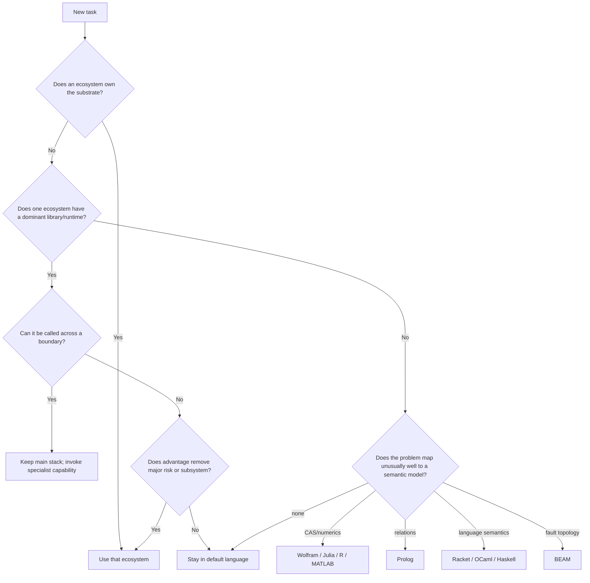

# Programming-Language Ecosystem Override Atlas

## Executive summary

The useful question is not which language is “best.” It is:

> **What capability is valuable enough that a competent developer should deliberately cross an ecosystem boundary instead of implementing it in their normal stack?**

After surveying the current ecosystems, the strongest overrides fall into four classes.

**Substrate ownership** is the strongest reason to switch. JavaScript/TypeScript owns the browser programming surface; Kotlin is the first-class Android language; C/C++ owns a large fraction of native SDKs and CUDA; PowerShell owns object-oriented Microsoft administration; SQL owns relational query execution; Lua is unusually well designed to be embedded; and JVM/.NET languages have privileged access to their respective runtime internals. These are not fashion advantages. They remove impedance mismatches. **Library monopolies or near-monopolies** are the next strongest reason. Java has Apache Tika for heterogeneous document extraction and Lucene for embedded search; C# has Roslyn for semantically correct C#/VB source analysis; R has Bioconductor; MATLAB/Simulink has an unusually integrated controls/model-based-design/code-generation stack; Haskell has Pandoc as an exceptionally capable document-conversion library/CLI. In these cases, the important discovery is often that you do **not** need to migrate the application—you can invoke the capability across a process, library, JAR, DLL, or command boundary. **Semantic/runtime advantages** justify crossing when they match the problem exactly. Julia's multiple dispatch and SciML stack make unusual numerical objects compose through solvers, differentiation, symbolic transformations and uncertainty machinery; Wolfram Engine is a formidable exact/symbolic computational oracle; Prolog makes relational search itself executable; Racket's `#lang` and Redex turn programming-language definition and operational semantics into normal programming activities; BEAM languages make independently failing processes and supervision part of the architectural model rather than a library convention. Finally, **deployment and interoperability economics** can be sufficient. Rust gives memory and thread-safety guarantees without a garbage-collected runtime; Zig makes C interoperability, explicit allocation and cross-target builds unusually central; Go remains exceptionally convenient for compact network/CLI deployments; .NET Native AOT has materially reduced the old “C# requires a runtime installation” objection; JBang has similarly reduced Java's old “you need a project before you can execute twenty lines” tax. My highest-confidence **“stop before implementing this in your default language”** triggers are therefore:

| Encounter this problem | Stop and consider | Why the boundary crossing is unusually defensible |
|---|---|---|
| Weird heterogeneous documents, archives, mail, Office/PDF metadata | **Java + Apache Tika/JBang** | Tika aggregates an enormous parser surface behind one API; JBang sharply lowers entry cost. |
| Embedded serious full-text/vector search | **Java + Lucene** | Mature in-process search engine rather than running a search service. |
| C# semantic/static-analysis/refactoring work | **C# + Roslyn** | Compiler syntax, semantic, control-flow and data-flow models are APIs. |
| Android UI/application | **Kotlin + Compose** | Google is explicitly Kotlin-first and Compose-first. |
| Browser-native application/extension/tool | **TypeScript** | The browser API surface is native JS; TS adds compile-time tooling while emitting ordinary JS. |
| Browser automation/E2E testing | **TS + Playwright Test** | All bindings share the browser implementation, but Node/TS gets Playwright's integrated runner, parallelization, tracing and screenshot assertions. |
| Novel numerical system, differentiable solver, ODE/SDE/PDE composition | **Julia + SciML** | Mathematical abstractions compose through solvers, AD, uncertainty, units, arbitrary precision and symbolic machinery. |
| Exact/symbolic computational reference implementation | **Wolfram Engine** | Very broad CAS; can be run locally and called as a separate computational service/process. |
| Biostatistics/genomics | **R + Bioconductor** | Domain ecosystem outweighs generic language considerations. |
| Control systems/model-based engineering with code generation | **MATLAB/Simulink** | Simulation, verification and generated production C/C++ live in one integrated workflow. |
| Hard native safety requirement without GC | **Rust** | Ownership/type system addresses memory and data-race classes at compile time. |
| Wrapping/building/cross-compiling C code | **Zig** | Direct C integration, C ABI output, built-in cross-target orientation and explicit allocation are core design points. |
| CUDA/GPU ecosystem work | **C++/CUDA** | NVIDIA's primary programming/runtime/tooling stack remains C/C++ centered. |
| Logic search/relational specification | **Prolog** | The computation itself can be relations and solution enumeration; SWI-Prolog can even expose engines remotely through Pengines. |
| Programming-language semantics/DSL research | **Racket/Redex** | Languages and operational semantics are first-class development artifacts. |
| Embedded user scripting | **Lua** | The implementation is deliberately a C library whose host can invoke Lua and register C functions. |
| Unix process composition | **sh/Bash** | Use the substrate rather than recreating it in an application language; the advantage disappears as soon as substantial state or structured computation appears. |
| Microsoft administrative automation | **PowerShell** | Pipelines exchange objects rather than reducing everything to text. |
| Existing Fortran scientific/HPC code or native numerical model | **Fortran** | Still active, standardized and unusually well aligned with array/HPC computation; modern community tooling now includes `fpm` and `stdlib`. |
| Universal document conversion | **Pandoc, regardless of your app language** | This is often a reason to call a Haskell program, not a reason to write a Haskell application. |

The meta-result is important: **the strongest ecosystem advantages are frequently callable capabilities, not reasons to rewrite an application.** Crossing a process boundary to Pandoc, Wolfram Engine, Babashka, a JBang utility, a Prolog engine, or a native Rust/Zig library can capture 80–95% of the ecosystem advantage without importing its build system, runtime model, staffing constraints and operational conventions into the rest of the product. This conclusion follows directly from the composability mechanisms exposed by Wolfram's LibraryLink/wolframscript, SWI-Prolog Pengines, Lua's C API, Zig's C ABI, JBang's executable/export modes and Pandoc's CLI/library design. ## Project-inception lookup

The following is the version I would actually keep beside an architecture notebook.

| Problem shape | First ecosystem to inspect | Specific capability | Activation cost | Boundary strategy |
|---|---|---|---|---|
| Extract text/metadata from arbitrary files | Java | Apache Tika | Low with JBang | One-file Java tool or service. |
| Search/index a local corpus | Java | Lucene | Low–medium | Embed in JVM utility/service. |
| Inspect/instrument JVM bytecode/runtime | Java | `java.lang.instrument`, JVM libraries | Low–medium | JBang/JAR/agent. |
| Million-ish blocking I/O activities | Java | Virtual threads | Low–medium | Ordinary synchronous-looking JVM program. |
| Spark-specific typed/internal work | Scala | Spark + Scala CLI | Medium | Small Scala module, not necessarily full migration. |
| Android | Kotlin | Jetpack Compose | Medium | Native app language. |
| Shared Android/iOS/desktop business logic/UI | Kotlin | Kotlin/Compose Multiplatform | Medium | Incremental shared modules. |
| Transform nested configuration/data interactively | Clojure | REPL + persistent-data idiom | Medium | JVM process/library. |
| Script such transformations with low startup cost | Babashka | Native Clojure interpreter | Low | `bb` script/CLI. |
| Analyze/refactor C# source | C# | Roslyn | Low–medium | .NET tool/library. |
| Windows/COM/native .NET integration | C# | .NET interop + Native AOT | Medium | Native-AOT executable/DLL. |
| Data-shaped typed functional .NET code | F# | DUs/inference/type providers | Medium | Same .NET process. |
| Browser APIs/extensions | JS/TS | Web APIs/WebExtensions | Essentially zero in browser | Native substrate. |
| Browser testing | TypeScript | Playwright Test | Low | Separate test package. |
| ML/scientific library gravity | Python | NumPy/SciPy/ML ecosystem | Low | Native Python or IPC/API. |
| New numerical abstractions and solver composition | Julia | SciML/Symbolics | Medium | Julia module/process. |
| Statistics/bioinformatics | R | Bioconductor/ggplot2 | Low–medium | R script/process/notebook. |
| Control engineering/model-based design | MATLAB | Simulink/toolboxes/code generation | High | Licensed dedicated subsystem. |
| Symbolic/exact reference computation | Wolfram | Wolfram Engine | High for production | `wolframscript`, WSTP or LibraryLink. |
| Document conversion | Haskell ecosystem | Pandoc | Very low as CLI | Call Pandoc. |
| Binary-analysis research | OCaml | BAP | Medium | Tool/plugin boundary. |
| Language semantics | Racket | Redex / `#lang` | Low–medium | Standalone research/tool module. |
| Relational search | Prolog | SWI-Prolog | Low–medium | CLI, embedded or Pengine. |
| Fault-isolated distributed processes | Erlang/Elixir | BEAM/OTP | Medium | Usually subsystem/service boundary. |
| Embedded extension language | Lua | Lua C API | Low | In-process embedding. |
| Native code with compile-time safety | Rust | Ownership/Cargo ecosystem | Medium | C ABI, executable, Wasm. |
| Cross-target native/C integration | Zig | Zig compiler/build+C interop | Low–medium | Library, executable, or build tool. |
| GPU kernel/platform code | C++ | CUDA | High | Native library/service. |
| Small network daemon/portable CLI | Go | Go toolchain/runtime | Low | Standalone executable. |
| Relational aggregation/windowing/joining | SQL | Database query engine | Usually zero once DB exists | Push computation to DB. PostgreSQL's current SQL surface includes window functions as a native query construct. |
| Windows administration | PowerShell | Object pipeline/modules | Essentially zero on modern Windows | Script/module. |
| Ancient/minimal Windows bootstrap | Batch | `cmd.exe` | Zero | Use only at bootstrap boundary. Microsoft's current command reference remains extensive. |

A useful decision procedure is:



The crucial branch is **“Can it be called across a boundary?”** A great many language comparisons implicitly assume that choosing a library implies choosing the language for the entire application. That assumption is increasingly obsolete: Rust explicitly emphasizes interoperability; Zig can export through the C ABI; Lua is designed for embedding; Wolfram offers multiple external interfaces; Node can consume WebAssembly; and JBang can export its work into several deployment forms. ## Domain and activation-cost comparison

I use the following activation-cost scale. It is deliberately about **engineering friction**, not language difficulty.

| Cost | Meaning |
|---|---|
| **A** | Runtime/tool is already part of the target substrate or is a trivial standalone install. |
| **B** | One normal toolchain/runtime install; packages are straightforward; good subprocess boundary. |
| **C** | Significant project/build/runtime conventions or specialized deployment knowledge. |
| **D** | Native-toolchain/FFI/platform complexity or a substantial parallel operational stack. |
| **E** | Commercial licensing, specialist infrastructure, or a particularly expensive organizational boundary. |

This produces a more useful comparison than popularity:

| Ecosystem | Strongest defensible domain | Cost | Easy to compose externally? | My confidence that crossing is sometimes worth it |
|---|---|---:|---|---:|
| C | Native ABI/firmware/lowest portable layer | D | **Excellent** | Very high |
| C++ | CUDA, LLVM/Clang, native SDKs/engines | D | Good via C wrappers | Very high |
| Rust | Memory-safe native systems | C | **Excellent** | Very high |
| Zig | C integration/cross-target native builds | B–C | **Excellent** | High |
| Go | Deployable network/CLI tools | B | Excellent via process/RPC | Medium |
| Java/JBang | Tika, Lucene, JVM internals | **B** | Excellent | **Very high** |
| Kotlin | Android/KMP | C | Good | **Very high on Android** |
| Scala | Spark/JVM functional-data work | C | Good | Medium-high in narrow cases |
| Clojure | Interactive structural/data transformation | C | Good through JVM | Medium |
| Babashka | Clojure-shaped scripting | **A–B** | Excellent | Medium-high |
| C# | Roslyn, Windows/.NET tooling | B–C | Excellent | **Very high** |
| F# | Typed functional .NET modeling | B–C | Excellent | Medium |
| JavaScript | Browser substrate/dynamic extensions | A | Native | **Very high in browser** |
| TypeScript | Browser/web tooling/Playwright | A–B | Native to JS | **Very high** |
| Python | ML/science/library gravity | B | Excellent | **Very high where ecosystem dominates** |
| Julia | Composable numerical systems/SciML | B–C | Good | **Very high for right numerics** |
| R | Statistics/Bioconductor | B | Excellent | High |
| MATLAB | Simulink/engineering toolboxes | E | Moderate | **Very high when toolbox owns problem** |
| Wolfram | Symbolic/exact computation | D–E production | Good | **Very high for CAS-shaped problems** |
| Haskell | Particular libraries; typed pure transformation | C | Excellent via CLI | Medium |
| OCaml | Compilers/formal methods/binary-analysis niches | C | Good | Medium-high |
| Common Lisp | Interactive/language-extensible systems | C | Moderate | Low–medium |
| Racket | DSL/language-semantics work | B | Good | High in a tiny niche |
| Prolog | Relational/constraint search | B | Good | High in a tiny niche |
| Erlang | BEAM/OTP fault-oriented systems | C | Service boundary preferred | High when architecture fits |
| Elixir | BEAM with more approachable application ecosystem | C | Service boundary preferred | High when architecture fits |
| Lua | Embedded scripting | **A–B** | **Exceptional** | **Very high** |
| Ruby | Rails/Ruby estate, DSL-heavy libraries | B | Excellent via process | Low outside existing estate |
| PHP | Existing PHP/web/WordPress/Laravel substrate | A–B | HTTP/process boundary | Low outside existing estate |
| Perl | CPAN/legacy text and Unix tooling | B | Excellent | Low–medium |
| Fortran | Existing HPC/numerical kernels/models | C–D | Good through C ABI | High when code/assets exist |
| SQL | Relational set computation | A once DB exists | **Native through DB protocol** | **Very high** |
| Bash/sh | Unix process composition/bootstrap | A | Native | High for tiny orchestration |
| PowerShell | Microsoft administration/object pipelines | A–B | Excellent | **Very high on its substrate** |
| Windows batch | Minimal Windows bootstrap | A | Native | Very low otherwise |

A few comparisons are especially revealing.

**Java versus Go/C#/Python for tiny tools has changed.** JBang can provision JDKs, resolve dependencies, cache compilations, install commands and export applications; Java virtual threads let blocking-I/O programs retain direct control flow at high concurrency. That does not make Java the universal scripting winner, but it removes a large part of its historical activation penalty. **C# deployment has also changed.** Native AOT produces self-contained native executables with no JIT at runtime and no installed .NET runtime requirement, so “I need a single deployable binary” is no longer by itself a strong reason to defect from .NET to Go or Rust. Native AOT has compatibility constraints, but the old categorical objection is stale. **Kotlin's competitive case has broadened but remains asymmetric.** Android is an overwhelming substrate advantage because Google explicitly designs modern guidance, libraries and Compose around Kotlin. Kotlin Multiplatform is now production-ready across its supported native application targets according to JetBrains, while Compose's web target remains less mature than Android/iOS/desktop; therefore “write everything cross-platform in Kotlin” is not as strong an override as “write Android in Kotlin.” **Julia's advantage is not generic speed.** It is the ability to make unusual mathematical representations flow through generic code and then specialize them, with SciML layering differentiation, solver infrastructure, arbitrary precision, units and uncertainty machinery on top. That is qualitatively different from merely having a fast array implementation. ## Evidence-backed ecosystem atlas

Each entry below explicitly covers the requested dimensions: **override condition; unfair advantage; competitors; activation; composability; maturity; concrete example; counterexample/myth; hidden gem; decision threshold.**

**C.** **Override:** choose C when the actual boundary is a C ABI, bare-metal/firmware interface, kernel/native SDK, or when you are defining the lowest interoperable layer other languages will consume. **Edge:** not language expressiveness but minimal runtime assumptions and ecosystem compatibility; even Zig's own interoperability story explicitly uses the C ABI as the route by which Zig libraries become callable elsewhere. **Competitors:** Rust and Zig are preferable for many new low-level components because they provide stronger language-level correctness machinery, while C++ has richer abstraction. **Activation/composition:** native toolchains raise build cost, but composition is excellent through shared/static libraries. **Maturity:** maximal, but that does not imply “best for new application code.” **Example:** implement a six-function hardware/vendor ABI shim in C and bind it from Python, C#, Java and Rust. **Counterexample:** “C is necessary for performance” is false as a general rule. **Hidden gem:** use C as *interchange tissue*, not necessarily the system implementation. **Threshold:** cross when ABI/substrate compatibility itself removes complexity. **C++.** **Override:** CUDA, game engines/native SDKs, LLVM/Clang internals, or a mature native library that would be painful to wrap. **Edge:** NVIDIA's CUDA compiler/runtime/library stack and Clang's first-class C-family AST/tooling infrastructure are concrete ecosystem monopolies or near-monopolies. **Competitors:** Rust offers a stronger safety baseline; Zig a simpler C-oriented model; Julia/Python often provide better high-level GPU consumers. **Activation:** high: compiler/linker/build/ABI complexity is real. **Composition:** good when you expose a deliberately narrow C ABI; less pleasant when C++ ABI/templates leak across the boundary. **Maturity:** enormous and current; Clang continues active language-standard implementation and tooling development. **Example:** a custom Clang source-to-source refactoring or CUDA extension. **Counterexample:** “use C++ because native code is fastest” is not sufficient. **Hidden gem:** LibTooling/clang-tidy can be more compelling than C++ itself. **Threshold:** cross when the C++-native library/tooling saves an entire subsystem, not for a speculative 10% performance gain. **Rust.** **Override:** native software where memory/resource correctness, concurrency safety or hostile inputs materially affect risk, yet a GC is undesirable. **Edge:** Rust's ownership/type system is expressly designed to guarantee memory and thread safety without requiring a garbage collector; Cargo makes the language unusually coherent as a complete systems-development package. **Competitors:** C++ can match performance/control but with weaker default static guarantees; Zig is easier at some C/toolchain boundaries but intentionally provides fewer safety guarantees; Go simplifies concurrency/deployment but uses GC. **Activation:** medium—tooling is pleasant, learning and FFI design are the cost. **Composition:** excellent via C ABI and increasingly Wasm/Python bindings. **Maturity:** active and mainstream. **Example:** parse attacker-controlled binary data in a reusable native library. **Counterexample:** Rust is not automatically faster than C++ or simpler than Go. **Hidden gem:** the real win is often deleting a *class of review obligations*, not runtime speed. **Threshold:** use when memory/resource correctness is important enough that compiler-enforced invariants amortize the complexity. **Zig.** **Override:** you are already fighting C headers, libc variants, allocators, target triples or a cross-compilation matrix. **Edge:** direct C-library integration without a separate binding generator, explicit allocators, first-class C-ABI output and a compiler deliberately designed around multiple targets; Zig can also produce freestanding/static binaries and use its toolchain even when the project itself is partly C. **Competitors:** Rust gives stronger safety; C has greater ubiquity; C++ has a far larger library ecosystem. **Activation:** relatively low for a native language: one toolchain, although ecosystem breadth is smaller. **Composition:** excellent through the C ABI. **Maturity:** active, but significantly younger and less ecosystem-stable than C/C++/Rust. **Example:** replace a cross-platform CMake wrapper project with Zig as the build/interop layer while retaining the C library. **Counterexample:** Zig is not “safe Rust but simpler”; it deliberately permits manual memory management and unsafe modes. **Hidden gem:** using Zig as a *C toolchain/build technology* can be more valuable than rewriting in Zig. **Threshold:** cross when native build/interop friction is already a meaningful part of the task. **Go.** **Override:** compact network services, agents or CLIs where fast builds, straightforward concurrency and simple deployment dominate richer modeling. **Edge:** a cohesive standard toolchain, goroutines/channels and excellent executable deployment ergonomics; modern Go has invested in reproducible toolchains and cross-compilation. **Competitors:** Java virtual threads now challenge the “simple blocking concurrency” story; Rust gives better low-level control; C# Native AOT narrows the deployment gap. **Activation:** low. **Composition:** easiest as an executable/service; C-shared-library integration is less idiomatic. **Maturity:** extremely active, with ongoing toolchain/language work. **Example:** a small HTTP/network collector distributed to hundreds of machines. **Counterexample:** “Go uniquely owns scalable concurrency” is obsolete. **Hidden gem:** deployment/tooling regularity is often more valuable than goroutines. **Threshold:** switch when operational simplicity is worth more than expressiveness, not merely because the program contains sockets. **Java + JBang.** **Override:** Tika/Lucene/JVM tooling or some exact Maven artifact already solves the hard portion; also consider it for disposable high-concurrency blocking-I/O programs. **Edge:** JBang collapses dependency resolution, compilation, JDK acquisition and command installation into a script-like workflow; Tika covers an extraordinary set of document formats; Lucene supplies sophisticated embedded full-text/vector search; the JVM exposes instrumentation APIs; virtual threads support enormous numbers of blocking tasks. **Competitors:** Python often wins general scripting; C# is better on .NET/Windows; Go produces simpler deployment artifacts. **Activation:** now low–medium rather than historically high. **Composition:** excellent by JAR/process/HTTP, with multiple export modes. **Maturity:** Java/Lucene/Tika are extremely mature, JBang remains actively developed. **Example:** 40-line utility recursively extracts metadata from PST/PDF/Office/archives and indexes it in Lucene. **Counterexample:** “Java requires Maven/Gradle boilerplate” is no longer generally true for utilities. **Hidden gem:** Tika even contains parsers for executable/container formats such as PE/ELF/Mach-O. **Threshold:** if a Maven library removes more than a few hours of bespoke implementation, use it. **Kotlin.** **Override:** Android immediately; consider KMP when shared mobile/desktop logic or UI is a project-level objective. **Edge:** Google explicitly develops Android Kotlin-first and now Compose-first; Kotlin Multiplatform can share business logic across Android/iOS/desktop/web/server, and Compose Multiplatform extends that to UI on its stable targets. **Competitors:** Swift remains stronger for Apple-only work; TypeScript/React Native and Dart/Flutter offer different cross-platform tradeoffs; Java has easier minimal JVM tooling through JBang. **Activation:** medium because Gradle/platform tooling remains substantial. **Composition:** superb with Java/JVM; increasingly good with native targets. **Maturity:** Kotlin 2.4.20 shipped in September 2026 and KMP remains a major roadmap priority. **Example:** Android app with shared networking/domain logic reused by iOS. **Counterexample:** Kotlin is not automatically a reason to replace Java merely to access Maven libraries. **Hidden gem:** KMP's incremental adoption model—you can share one module instead of committing to a universal UI rewrite. **Threshold:** Android: almost zero; elsewhere: cross when sharing removes duplicated platform logic of meaningful size. **Scala.** **Override:** when JVM-library access, sophisticated functional/domain modeling and especially Scala-native Spark work coincide. **Edge:** Scala CLI has substantially reduced old SBT ceremony, supporting source directives/dependencies and even native/script workflows; Spark itself remains deeply Scala-rooted even though its DataFrame API is exposed in several languages. **Competitors:** Kotlin/Java are easier general JVM choices; Python dominates Spark user workflows; F#/Haskell offer strong functional modeling without JVM-specific advantages. **Activation:** medium, now lower for isolated tools thanks to Scala CLI. **Composition:** excellent with Java. **Maturity:** Scala CLI and Spark remain actively maintained. **Example:** a small typed Spark extension or JVM data-processing tool where algebraic modeling matters. **Counterexample:** “use Scala for Spark” is too broad—ordinary Spark DataFrame users may be happier in Python. **Hidden gem:** Scala CLI can export a prototype into SBT/Mill and can compile Scala Native programs. **Threshold:** cross when you need something genuinely Scala-native or the domain-model advantage is substantial; not merely for prettier Java. **Clojure.** **Override:** highly interactive transformation/exploration over maps, sequences, trees and symbolic structures, especially when JVM access matters. **Edge:** the live REPL is treated as a first-class UI into the running program rather than merely an expression calculator; Lisp data/code representation and JVM interoperability make structural transformation unusually fluid. **Competitors:** F#/Scala give stronger static modeling; Python has broader scientific/data adoption; Racket is stronger for constructing new languages. **Activation:** medium due JVM/Clojure tooling. **Composition:** excellent with JVM libraries. **Maturity:** Clojure remains actively released, with 1.13 alphas in 2026. **Example:** interactively develop a pipeline that normalizes several irregular nested configuration/data formats without restarting the process. **Counterexample:** Clojure is not automatically the best JVM backend merely because immutability is desirable. **Hidden gem:** `-Sdeps` makes ephemeral dependency experiments possible directly from the CLI. **Threshold:** cross when exploratory structural manipulation is the central difficulty rather than merely one stage of a conventional application. **Babashka.** **Override:** the problem is Clojure-shaped but shell-script-sized. **Edge:** it is a native, fast-starting Clojure interpreter with batteries aimed at scripting/tasks/processes; current 2026 releases are active and have even been adding experimental FFI work. **Competitors:** PowerShell beats it for Microsoft administration; Python has far greater library breadth; Bash wins when the task is almost entirely piping existing commands. **Activation:** very low: a standalone `bb` executable. **Composition:** naturally via subprocesses and increasingly native FFI; a current experimental package exposes DuckDB directly through `babashka.ffi`. **Maturity:** active, but intentionally not identical to a complete JVM Clojure environment. **Example:** recursively load EDN/JSON/YAML-ish configuration, transform nested data and orchestrate programs without writing brittle shell. **Counterexample:** it does not make arbitrary JVM Clojure dependencies magically native-compatible. **Hidden gem:** Babashka as a *structured shell replacement*. **Threshold:** cross once a shell script starts wanting real immutable data structures and nontrivial transformations. **C#.** **Override:** C#/VB source semantics, .NET/Windows/COM integration, or a substantial typed utility/application that benefits from the .NET platform. **Edge:** Roslyn is the standout unfair advantage: syntax trees, semantic models, analyzers and control/data-flow machinery come from the compiler platform itself. Native AOT and source-generated COM support have also materially improved deployment/native integration. **Competitors:** tree-sitter can parse many languages but cannot replace compiler-semantic knowledge for C#; Java has comparable VM maturity but not Roslyn; Rust/C++ offer lower-level native control. **Activation:** low–medium. **Composition:** excellent through .NET, native libraries, COM, IPC and Native AOT. **Maturity:** extremely active. **Example:** determine which C# expressions actually refer to a symbol, follow its semantic usage and emit an automated fix. **Counterexample:** “C# implies installed .NET/JIT deployment” is no longer categorical because Native AOT exists. **Hidden gem:** Roslyn's control/data-flow analysis is far deeper than AST traversal. **Threshold:** for C# semantic tooling, essentially zero; for generic utilities, stay with your existing default unless .NET integration helps. **F#.** **Override:** .NET is desirable but the problem is predominantly transformations, parsers, state machines, mathematical/data modeling or data-schema interaction. **Edge:** discriminated unions, inference and functional composition make illegal-state modeling easier than idiomatic C#, while retaining essentially the entire .NET ecosystem; Type Providers remain an unusually distinctive bridge from external schemas/data to compile-time types. **Competitors:** C# now has richer pattern matching/records and wins staffing/tool familiarity; OCaml/Haskell provide purer ML-family environments but lose .NET integration. **Activation:** medium but shares .NET installation and libraries with C#. **Composition:** excellent. **Maturity:** stable, smaller community. **Example:** represent a protocol state machine as a DU and let exhaustive matching expose unhandled states. **Counterexample:** “F# is C# but functional” understates both its strengths and its ecosystem cost. **Hidden gem:** Type Providers for schema-rich analytical work. **Threshold:** use when the domain model becomes materially simpler than its C# equivalent; otherwise C#'s ecosystem gravity wins. **JavaScript.** **Override:** the browser itself is the execution environment, or runtime dynamism is part of the job—extensions, page instrumentation, injected tooling, web APIs. **Edge:** JavaScript directly consumes the browser's extensive native API surface and WebExtensions APIs; WebAssembly is explicitly designed to coexist with it, allowing performance-sensitive code from Rust/C/C++/C# to be imported rather than forcing the web layer out of JavaScript. **Competitors:** TypeScript should usually replace raw JS for larger codebases; Wasm can own computational kernels but does not replace the browser integration layer. **Activation:** effectively zero in browser. **Composition:** exceptional via Wasm, JSON, HTTP and native Node add-ons. **Maturity:** foundational web substrate. **Example:** browser extension manipulating tabs, page DOM and browser events. **Counterexample:** dynamic typing itself is rarely a compelling reason to prefer JS over TS for a large maintainable application. **Hidden gem:** JS can be the *integration shell around Wasm* rather than the computation language. **Threshold:** browser requirement: immediate; otherwise prefer TS unless dynamism is specifically valuable. **TypeScript.** **Override:** browser applications, npm-native tooling, browser automation, JS API clients or systems where faithfully typing dynamic JS object shapes is important. **Edge:** TypeScript adds static tooling while preserving JavaScript's execution substrate and gradual adoption; its structural and highly expressive type system models JavaScript patterns that nominal languages often fight. Playwright's Node/TS binding has an integrated test runner with parallelization, screenshots, HTML reporting and automatic tracing beyond the common cross-language browser API. **Competitors:** C#/Java are stronger for runtime-enforced type models; Python's Playwright binding is capable but does not get precisely the same integrated testing ecosystem. **Activation:** low. **Composition:** excellent. **Maturity:** extremely active. **Example:** typed Playwright test suite sharing types and helpers with the web application. **Counterexample:** TypeScript types are not runtime validation and do not make arbitrary external JSON trustworthy. **Hidden gem:** gradual `@ts-check`/JSDoc adoption can improve existing JS without immediate conversion. **Threshold:** whenever the target is primarily JS; little reason to cross into TS for non-JS substrate work. **Python.** **Override:** the canonical implementation/library is Python—especially ML, scientific computing, notebooks, data/image/audio processing—or you need low-friction orchestration around native libraries. **Edge:** library gravity rather than language semantics: NumPy provides the central numerical array substrate and SciPy layers a broad set of mathematical algorithms on it. **Competitors:** Julia wins some compositional numerical-system problems; R wins some statistical/bioinformatics domains; C++/Rust win native systems work. **Activation:** low. **Composition:** superb through processes, C extensions and ubiquitous embedding/API patterns. **Maturity:** enormous. **Example:** prototype a signal/data pipeline using mature scientific libraries in tens of lines. **Counterexample:** “Python is slow” is misleading for NumPy/SciPy-shaped work because much computation executes in optimized native kernels; conversely, that does not make arbitrary Python loops fast. **Hidden gem:** Python's main advantage is often being the *lingua franca between specialist native packages*. **Threshold:** if the canonical package or research implementation is Python, use it unless deployment/runtime constraints dominate. **Julia.** **Override:** you are *building a numerical system* rather than merely calling numerical routines—new scalar types, differentiable solvers, ODE/SDE/PDE systems, uncertainty/unit propagation, inverse problems or scientific ML. **Edge:** multiple dispatch on all participating argument types plus aggressive specialization makes mathematical genericity central; SciML composes solvers with arbitrary precision, unit checking, uncertainty and differentiation; Symbolics can trace ordinary Julia code with symbolic arguments and compile transformed expressions back to callable functions. **Competitors:** Python has broader ecosystem gravity; C++/Rust offer stronger systems control; MATLAB has stronger proprietary engineering toolboxes. **Activation:** medium. **Composition:** Julia can be separated as a numerical service/library, though deployment is less frictionless than Python or a native static library. **Maturity:** SciML is deep and active, but practitioner reports still identify package latency/complexity and larger-system engineering as areas where alternatives can win. **Example:** define a custom unit/dual-number state, solve an ODE over it, differentiate through the solution and generate optimized numerical code. **Counterexample:** Julia's argument is not “faster Python.” **Hidden gem:** symbolic values participating in ordinary generic Julia functions rather than living entirely in a separate CAS world. **Threshold:** cross when mathematical abstraction/composition itself is causing friction in Python/C++/MATLAB. **R.** **Override:** modern statistical methodology, biostatistics/genomics, or analysis where the R package is the canonical implementation. **Edge:** Bioconductor is a maintained, release-managed ecosystem explicitly built around R for biological computation; ggplot2's Grammar-of-Graphics model remains a distinctive and mature way to specify statistical graphics. **Competitors:** Python has broader general ML/data-engineering adoption; Julia can be stronger for new numerical systems; MATLAB dominates some engineering disciplines. **Activation:** low–medium. **Composition:** excellent through scripts/processes and exchange formats. **Maturity:** Bioconductor continues scheduled releases and active 2026 publication activity. **Example:** differential-expression/genomic analysis where the accepted pipeline is already packaged in Bioconductor. **Counterexample:** “R is the statistical language, therefore all statistics belong in R” is too broad—many routine statistical tasks have excellent Python/Julia equivalents. **Hidden gem:** domain credibility/reproducible package conventions can matter more than raw API quality. **Threshold:** cross when a field-standard R package eliminates methodological risk, not merely for `mean()` and a regression. **MATLAB.** **Override:** required engineering toolbox, Simulink model, control/signal workflow, hardware integration, or model-based design where simulation, verification and generated embedded C/C++ must coexist. **Edge:** the unfair advantage is the *integrated proprietary system*: a large toolbox portfolio plus Simulink, continuous testing/verification and production-code generation. **Competitors:** Python/Julia frequently win open numerical research; Modelica competes in physical modeling; C/C++ is closer to deployed code but loses the modeling environment. **Activation:** high because licensing and specialist tooling matter. **Composition:** generated C/C++, APIs and external integration make it composable, but licenses can constrain architecture. **Maturity:** extremely mature. **Example:** control algorithm modeled in Simulink, exercised against plant simulation and generated into embedded C. **Counterexample:** MATLAB is not the obvious choice for ordinary linear algebra merely because matrices are involved. **Hidden gem:** the code-generation/testing chain is often the real moat, not the MATLAB language. **Threshold:** cross when a toolbox or certification/model-based workflow eliminates major engineering work; otherwise open alternatives usually deserve first look. **Wolfram Language / Engine.** **Override:** symbolic integration/algebra, exact computation, special-function manipulation, equation solving, transformations, symbolic reference models or broad CAS tasks. **Edge:** an unusually broad symbolic computational system that can run locally; `wolframscript`, WSTP and LibraryLink let it be treated as a computational engine instead of requiring the application itself to be written in Wolfram Language. **Competitors:** SymPy is free and Python-native but substantially less encyclopedic; Julia Symbolics is better integrated with Julia numerical compilation; Mathematica's breadth remains the reason to cross. **Activation:** experimentally moderate, production potentially high because licensing matters; the free Engine license is explicitly aimed at development/pre-production use, including testing, rather than unrestricted production computation. **Composition:** very good. **Maturity:** exceptional. **Example:** use Wolfram as an independently implemented oracle for differential-testing a numerical identity or solver. **Counterexample:** symbolic computation need not imply building the whole application in Mathematica. **Hidden gem:** exact and arbitrary-precision values can remain unevaluated/exact rather than collapsing into machine floats. **Threshold:** call it when the CAS problem would otherwise consume substantial implementation/research time; for production, price the license boundary early. **Haskell.** **Override:** a specific Haskell asset is overwhelmingly better, or purity/strong static typing materially simplifies a compiler, transformation pipeline or DSL. **Edge:** one practical unfair advantage is Pandoc: a mature universal document converter available both as CLI and Haskell library. QuickCheck also historically established property-based testing as a first-class executable specification style, though that idea has now spread broadly. **Competitors:** OCaml/F# offer ML-family modeling with different ecosystem advantages; Rust gives more predictable systems deployment; property testing is available nearly everywhere. **Activation:** medium if adopting the language, trivial if calling Pandoc. **Composition:** excellent at executable boundaries. **Maturity:** Pandoc reached its twentieth anniversary in 2026 and remains active. **Example:** call Pandoc rather than writing Markdown/DocBook/LaTeX conversion code. **Counterexample:** property-based testing alone is no longer a Haskell override. **Hidden gem:** the correct boundary often is “use this Haskell executable,” not “hire a Haskell team.” **Threshold:** language adoption requires a substantial modeling advantage; invoking a dominant Haskell CLI requires almost none. **OCaml.** **Override:** compiler/solver/formal-methods work or a specific OCaml research ecosystem asset. **Edge:** OCaml remains heavily represented in compiler/proof/solver tooling; BAP is a particularly interesting hidden asset—a binary-analysis platform with plugin architecture, symbolic-execution capabilities and its own Primus Lisp DSL. Formal-verification tooling around Gospel, Ortac, Cameleer and CFML illustrates an unusually rich verification neighborhood. **Competitors:** Rust is stronger for mainstream native systems; Haskell for purity/type-driven research; F# when .NET integration dominates. **Activation:** medium; opam and native Windows support have improved practical usability. **Composition:** CLI/library boundaries are straightforward. **Maturity:** active, with multicore-era libraries such as Eio and continuing opam development. **Example:** binary-analysis research prototype built as a BAP plugin rather than recreating instruction lifting and analyses. **Counterexample:** OCaml is not automatically superior for every compiler merely because many compilers are written in ML-family languages. **Hidden gem:** BAP/formal-verification ecosystem. **Threshold:** cross when the research/tool ecosystem itself is relevant. **Common Lisp.** **Override:** a long-lived interactive system where macros, runtime redefinition, CLOS/metaobject-style extensibility or image-oriented development are central to the architecture. **Edge:** the strongest case remains language malleability and interactive development rather than a uniquely dominant modern external library. **Competitors:** Clojure provides Lisp ergonomics with JVM gravity; Racket is stronger for explicit language construction; Smalltalk images provide an even more image-centric development model. **Activation:** medium because implementation/library choices and deployment conventions differ from mainstream stacks. **Composition:** possible through C FFI and processes but not a special advantage. **Maturity:** mature implementations persist, but this research pass did **not** uncover a 2026 ecosystem monopoly comparable to Tika, Roslyn, SciML or Bioconductor. **Example:** application whose internal DSL and live redefinition are part of its product-development model. **Counterexample:** macros alone are not enough reason to cross ecosystems. **Hidden gem:** interactive redefinition of a substantial running system. **Threshold:** very high—use because Lisp's extensibility is itself the design, not because a utility needs a parser.

**Racket.** **Override:** you are designing a language, teaching/researching semantics, implementing interpreters, or specifying reduction systems. **Edge:** source files can select their language with `#lang`; Redex lets you define grammars, reduction relations, metafunctions and judgments, generate tests and typeset semantics. **Competitors:** Common Lisp macros are powerful but do not provide the same language-oriented framework; parser generators can create syntax but not the whole language/semantics environment; proof assistants offer stronger proof guarantees but more ceremony. **Activation:** low–medium. **Composition:** usually a research/tool boundary. **Maturity:** long-lived and still actively documented. **Example:** specify a small-step operational semantics, generate randomized terms and test a preservation-like property without first implementing a conventional compiler. **Counterexample:** Racket is not a general advantage for an ordinary web service. **Hidden gem:** Redex is closer to an executable PL paper than to a conventional testing library. **Threshold:** cross immediately when the artifact you are building is a language or semantics. **Prolog.** **Override:** the problem is naturally a set of relations plus search—configuration, symbolic inference, finite structural search, rule systems or some constraint problems. **Edge:** unification and backtracking are the execution model rather than libraries bolted onto an imperative host. SWI-Prolog's Pengines are a particularly useful composition feature: remote Prolog engines can be queried over HTTP, including from JavaScript, yielding solutions incrementally. **Competitors:** Z3/SMT is stronger when satisfiability over rich logical theories is the real problem; OR-Tools excels at industrial optimization; ordinary languages are easier when the search is incidental. **Activation:** low–medium. **Composition:** better than commonly assumed because a Prolog solver can sit behind an API/Pengine boundary. **Maturity:** SWI-Prolog is mature. **Example:** enumerate all structures satisfying a relational specification without writing explicit candidate-generation/backtracking control. **Counterexample:** Prolog is not synonymous with “AI” and is not automatically the right solver for numerical optimization. **Hidden gem:** Pengines. **Threshold:** cross when your imperative implementation starts becoming a home-grown unifier/backtracker. **Erlang.** **Override:** very large numbers of isolated, stateful activities where failure/restart/distribution semantics are central rather than incidental. **Edge:** the BEAM process model and OTP architecture; current Erlang releases continue to support extremely large process populations—the default process limit was raised to 1,048,576 in OTP 27's development cycle. **Competitors:** Go and Java virtual threads provide lightweight concurrency but do not make fault supervision/distributed process semantics the same architectural primitive; Kubernetes can restart services but operates at a much coarser level. **Activation:** medium and entails adopting BEAM conventions. **Composition:** best as a service boundary. **Maturity:** decades of production history and active OTP releases. **Example:** stateful messaging/session subsystem in which individual logical workers may crash and restart independently. **Counterexample:** “millions of processes” by itself is no longer sufficient—the distinction is failure semantics. **Hidden gem:** designing *failure topology* explicitly. **Threshold:** cross when restart/isolation architecture is central enough to justify a separate runtime. **Elixir.** **Override:** essentially the same BEAM-shaped systems as Erlang, when a more approachable modern application language/ecosystem is preferable to direct Erlang. **Edge:** it inherits BEAM/OTP's lightweight-process and fault-isolation model while presenting a different language/tooling layer. **Competitors:** Erlang is closer to OTP internals and existing telecom estates; Go/Java are easier organizationally in many shops but do not reproduce OTP's failure model merely by offering cheap tasks. **Activation:** medium. **Composition:** service boundary is usually the clean choice. **Maturity:** mature enough for substantial production systems; the fundamental advantage is the BEAM rather than syntax. **Example:** event/session service where supervised processes encapsulate independently recoverable state. **Counterexample:** Elixir is not automatically superior for stateless CRUD APIs. **Hidden gem:** the language should be evaluated as an interface to OTP, not as “Ruby-looking functional syntax.” **Threshold:** same as Erlang: use when supervision/failure isolation removes architectural complexity, otherwise stay in the default backend stack. **Lua.** **Override:** a native program/game/tool needs a safe-ish, lightweight, user-programmable extension/configuration layer. **Edge:** this is almost purpose-built: Lua is implemented as a library in clean C, its host can execute Lua, read/write values and register C functions, and userdata provides a controlled bridge to native objects. **Competitors:** JavaScript/V8 and Python provide much larger ecosystems but vastly larger embedding/runtime footprints; Scheme implementations can be small but lack Lua's enormous embedding track record. **Activation:** low. **Composition:** arguably the best in this survey for its niche. **Maturity:** Lua 5.4 documentation remains current through 2026. **Example:** expose selected engine operations to user-written scripts without recompiling the host. **Counterexample:** Lua's smallness is not by itself a reason to build an ordinary standalone SaaS application in it. **Hidden gem:** Lua is encoding-agnostic and its sole table abstraction can represent arrays, maps, records, trees and graphs with very little host-language impedance. **Threshold:** if “we need an embedded scripting language” is literally in the requirements, Lua should be on the first shortlist. **Ruby.** **Override:** existing Rails/Ruby systems, a gem that is uniquely mature for the problem, or a DSL-heavy domain where Ruby's metaprogramming genuinely compresses the representation. **Edge:** today the competitive advantage is mostly ecosystem/installed-base pull rather than a unique runtime capability. **Competitors:** Python, TypeScript, C#, Java/Kotlin and Elixir all cover modern application-server territory strongly. **Activation:** low. **Composition:** excellent through process/API boundaries. **Maturity:** mature, but this research pass did not find a capability strong enough to recommend a greenfield cross-ecosystem jump on the scale of Roslyn/Tika/SciML. **Example:** extending a Rails application or consuming a Ruby-native domain gem. **Counterexample:** “developer happiness” is not a defensible architectural moat. **Hidden gem:** internal DSL expressiveness can still be valuable when the DSL *is* the product representation. **Threshold:** high unless you are already in the Ruby/Rails estate.

**PHP.** **Override:** the target substrate is already PHP—WordPress, Laravel, an installed PHP estate, or commodity hosting with PHP as the operational common denominator. **Edge:** deployment ubiquity and enormous web installed base, not a language feature inaccessible elsewhere. **Competitors:** almost every contemporary server language is a plausible greenfield alternative. **Activation:** low wherever the substrate already exists. **Composition:** naturally through HTTP/process boundaries. **Maturity:** extremely mature, but this research pass found no specialist capability that would make me recommend crossing from a healthy non-PHP stack solely to obtain it. **Example:** WordPress plugin or extension to a Laravel estate. **Counterexample:** easy web deployment is no longer exclusive to PHP. **Hidden gem:** the correct advantage is often *organizational compatibility with an enormous existing platform*, not technical novelty. **Threshold:** cross only when the target platform is already PHP-native or a PHP package materially dominates alternatives.

**Perl.** **Override:** a legacy Perl estate, an exact CPAN distribution that solves an ugly problem, or dense text/sysadmin work where existing Perl expertise matters. **Edge:** CPAN remains extraordinary in accumulated breadth: its index currently reports tens of thousands of distributions and has been online since 1995. **Competitors:** Python now covers most general scripting use with a larger contemporary mindshare; shell/AWK may win tiny text jobs; Rust/Python have strong parser ecosystems. **Activation:** low–medium, although native CPAN dependencies can still trigger compiler/toolchain friction. **Composition:** straightforward through processes and C interfaces. **Maturity:** CPAN remains live, though parts of its historical infrastructure are aging. **Example:** reuse a battle-tested protocol/file-format CPAN module instead of recreating it. **Counterexample:** regex syntax is no longer a sufficient reason to choose Perl. **Hidden gem:** twenty-plus years of obscure protocol/file/Unix modules. **Threshold:** an exact CPAN module or estate requirement must save substantial effort. **Fortran.** **Override:** extending serious existing scientific/HPC codes, interoperating with established numerical models, or working in communities where canonical solvers are Fortran. **Edge:** mature array-oriented numerical/HPC semantics and decades of scientific code; importantly, this is not purely historical—Fortran 2023 is current, the language remains under active development, and community projects such as `stdlib` and the Fortran Package Manager modernize its surrounding ecosystem. **Competitors:** Julia is dramatically nicer for new composable numerical systems; C++ dominates broader HPC infrastructure; Python is the orchestration/research lingua franca. **Activation:** medium–high because compiler/HPC environments matter. **Composition:** C interoperability makes existing kernels reusable elsewhere. **Example:** modify an established atmospheric/ocean/finite-element model instead of porting decades of validated code. **Counterexample:** “Fortran is always fastest for numerics” is not a defensible universal claim. **Hidden gem:** modern coarrays/teams/events and a growing community standard library. **Threshold:** legacy/domain asset gravity must be substantial; greenfield general numerics should compare Julia/C++/Python first. **SQL.** **Override:** the computation is fundamentally relational—joins, grouping, filtering, windows, recursive relationships or aggregation over data already in a capable database. **Edge:** declarative semantics let the database optimizer choose access/join/execution strategies with knowledge of indexes/statistics that an external row-by-row program discards; modern SQL engines expose sophisticated operations such as window functions directly. **Competitors:** dataframe systems and LINQ can express similar transformations but often pull computation away from the data or target a different optimizer. **Activation:** effectively zero when the DB exists. **Composition:** exceptional through every mainstream DB protocol. **Maturity:** foundational. **Example:** replace a Python/C# loop that loads millions of rows, groups them and computes running values with one database-side query/window expression. **Counterexample:** SQL is poor orchestration and general application control flow. **Hidden gem:** before exporting data, ask whether the query engine can perform the transformation in place. **Threshold:** if most inputs are already relational and the operation is set-oriented, SQL should win by default. **Bash/sh.** **Override:** the problem is literally “launch these processes, connect these streams, inspect these files/environment variables and exit.” **Edge:** Unix process composition has unmatched notation density because process spawning, pipes, redirections and environment interaction are the language's substrate. **Competitors:** Python/Babashka/PowerShell become superior quickly once structured state, retries, concurrency or data modeling grows. **Activation:** effectively zero on Unix-like environments. **Composition:** it *is* the process boundary. **Maturity:** foundational. **Example:** `producer | filter | sort | compressor > artifact`. **Counterexample:** shell is not automatically the fastest way to write a 500-line automation program; quotation/error semantics become a tax. **Hidden gem:** use shell as an orchestration membrane around stronger specialist tools. **Threshold:** stay in shell while the program is primarily a pipeline; leave once the shell starts pretending to be a data-structure language.

**PowerShell.** **Override:** Windows/.NET/Microsoft administration or automation over structured command output. **Edge:** the pipeline transmits objects one at a time rather than merely textual byte streams, preserving properties/types through composition. **Competitors:** Bash is denser for classic Unix process text streams; Python is more portable and better for algorithms; C# is better when the script becomes a real application. **Activation:** effectively zero on Windows and straightforward elsewhere. **Composition:** excellent with .NET objects, native commands and REST APIs. **Maturity:** current official documentation continues to center object pipelines. **Example:** enumerate services/users/resources, filter on properties, mutate selected objects without reparsing formatted console text. **Counterexample:** PowerShell is not categorically better than shell for portable CLI plumbing. **Hidden gem:** it can directly consume .NET APIs when commandlets stop short. **Threshold:** Microsoft administrative object model present → switch early. **Windows batch/cmd.** **Override:** only when `cmd.exe` is the guaranteed denominator: ancient enterprise scripts, bootstrap environments, installers or compatibility constraints. **Edge:** availability. Microsoft's current Windows command documentation still covers the command shell and its large built-in command set. **Competitors:** PowerShell is better for almost every nontrivial modern Windows automation task; Python/C#/Go are better application languages. **Activation:** zero. **Composition:** native to Windows process launching. **Maturity:** effectively compatibility infrastructure. **Example:** five-line bootstrap that runs before PowerShell/.NET/other tooling is guaranteed. **Counterexample:** batch is not a serious contender for structured new automation. **Hidden gem:** none worth romanticizing—the virtue is that it is already there. **Threshold:** use only when availability is itself the requirement. ## Surprising cross-language opportunities

The most useful findings were not the obvious “Kotlin for Android” variety. They were places where a small boundary crossing can buy a disproportionate capability.

**Java as a specialist-library shell is probably the largest underexploited opportunity.** Tika is not merely “a PDF parser”: its current parser families span Office formats, archives, mail/PST, OneNote, WARC/WACZ, scientific formats and more, while Lucene gives you embedded indexing/search without standing up an Elasticsearch/OpenSearch service. JBang then makes invoking those ecosystems look more like running a script than initializing an enterprise project. That combination materially changes Java's position for one-off forensic, corpus, migration and information-retrieval tools. **Roslyn is a reason to call C# even from a non-.NET application.** If the input language is C#, syntactic approximations through regex/tree-sitter are fundamentally weaker once questions become semantic: overloaded call resolution, symbol identity, inferred types, control flow, data flow and compiler diagnostics. A tiny .NET analysis worker can be a better architecture than reimplementing a partial C# compiler in the host language. **Wolfram makes more sense as a testing/reference oracle than many people realize.** Running `wolframscript` locally lets an ordinary program outsource exact/symbolic subproblems. For differential testing, this is attractive precisely because Wolfram is independently implemented: agreement between your numerical implementation and an independently derived symbolic/exact reference can be more valuable than implementing both sides in the same library stack. Licensing needs explicit attention before operational production use. **Julia deserves evaluation specifically when custom mathematical objects need to survive through an entire numerical pipeline.** The interesting test is not whether Julia beats NumPy on matrix multiplication; BLAS can make that comparison nearly irrelevant. The interesting test is whether `Dual{Quantity{...}}`, arbitrary precision, symbolic values, uncertainty or another unusual representation can propagate through a solver, differentiator and optimizer without dropping into bespoke extension code. SciML is explicitly built around that sort of generic composition. **Babashka can occupy a niche that is strangely underserved between shell and Python.** When the script is mostly orchestration but its data becomes trees/maps/sets rather than lines of text, Babashka gives Clojure's data-processing model without paying normal JVM startup costs. Its September 2026 release stream and new experimental FFI work indicate that this is a living ecosystem, not an abandoned GraalVM novelty. **Zig may be more interesting as a native-toolchain adapter than as “the language to rewrite C in.”** Its own documentation explicitly emphasizes C integration, C ABI interoperability, freestanding targets and cross compilation. A project with an ugly C library plus an uglier build matrix can gain Zig's advantage while leaving most source code untouched. **Pandoc is the canonical example of crossing without adopting.** Haskell's ecosystem can win a task even when Haskell loses the application-language decision. If the job is high-fidelity conversion among Pandoc's formats, spawning Pandoc is frequently saner than hunting for a “native” library in your preferred language just to preserve stack purity. **Prolog can likewise be a solver component rather than an application platform.** SWI-Prolog's Pengines permit remote engines queried over HTTP or from JavaScript, which means relational search can be isolated behind an explicit boundary. The common objection “we cannot write our system in Prolog” is therefore beside the point. **Lua's embedding story is stronger than “small scripting language.”** Its core design assumes a host program: the host can execute code, read/write Lua values and register native C functions. When applications bolt on Python, V8 or bespoke expression languages merely to expose configuration/extensions, Lua deserves a deliberate comparison. **Kotlin Multiplatform has become a real incremental strategy rather than a binary religion.** JetBrains explicitly supports selectively sharing modules, and native platform integration remains available. That makes “share domain/network logic first; decide about shared UI later” a much more interesting migration strategy than either fully separate Swift/Kotlin implementations or an all-in cross-platform framework. **The activation-cost revolutions matter.** Java through JBang, Scala through Scala CLI, C# through Native AOT, Clojure through Babashka, and JavaScript through increasingly portable runtimes/Wasm integration are all easier to deploy or experiment with than the stereotypes formed around those ecosystems ten years ago. Language-selection heuristics that still assume “Java means Maven project,” “Scala means SBT ceremony,” “Clojure means JVM startup,” or “C# means installed CLR/JIT” are simply stale. ## Where the supposed advantages do not hold

Several popular “language advantages” did **not** survive a skeptical comparison.

**Concurrency is no longer a Go monopoly.** Goroutines remain good, but Java virtual threads explicitly target massive numbers of mostly-blocking tasks, BEAM has had lightweight processes for decades, Kotlin has structured coroutine machinery, and C#/Rust have capable async runtimes. “This server has lots of connections” is insufficient reason by itself to switch languages. The stronger Go argument is the complete package of toolchain simplicity, deployment and concurrency ergonomics. **“Fast” is almost never a defensible standalone ecosystem advantage.** C, C++, Rust, Zig, Fortran and Julia can all generate very fast code under appropriate workloads, while Python/R/Matlab frequently delegate kernels to native optimized implementations. Performance decisions need workload-specific benchmarks; language-label benchmarks mostly measure implementation choices, library paths and benchmark design. Julia's strongest argument is compositional numerical genericity, Rust's is static safety without GC, Zig's is native/C-tooling control, and Fortran's is validated scientific asset gravity—not a universal speed crown. **Functional programming is not, by itself, sufficient reason to cross.** C#, Kotlin, Java, Rust, TypeScript and Python have absorbed substantial functional idioms. F#, Haskell, OCaml and Clojure become compelling when stronger properties matter—algebraic modeling, purity, interactive immutable transformations, type providers, compiler/formal-method ecosystems—not merely because `map` and immutable values exist. F#'s Type Providers and OCaml's verification ecosystem are examples of *specific* reasons; “FP is elegant” is not. **Property-based testing no longer belongs to Haskell.** QuickCheck was formative and remains important, but the idea has propagated across languages. Haskell needs a stronger override than “we want generators and shrinking.” **“Scala for Spark” is too crude.** Spark exposes DataFrame functionality across Scala, Java, Python and R. Scala retains advantages when using Scala-native internals, typed JVM APIs or combining Spark with sophisticated Scala modeling, but ordinary analytics does not require crossing from Python simply because Spark itself is Scala-rooted. **“Java for enterprise” and “C# for business applications” are descriptions of installed bases, not unfair technical advantages.** Java becomes interesting across the boundary when Tika, Lucene, JVM instrumentation or virtual threads specifically help. C# becomes interesting when Roslyn, Windows/.NET integration or another .NET-native capability helps. Generic CRUD is not an ecosystem monopoly. **Ruby and PHP currently have weak greenfield override cases outside their estates.** Rails and PHP's web platforms remain productive and enormous, but the research did not reveal a capability so singular that I would advise a healthy C#/Java/TS/Python/Go team to introduce Ruby or PHP merely to acquire it. The override is usually “the system/platform/package is already there,” which is real but qualitatively different from Tika, Roslyn, Bioconductor or Simulink.

**Common Lisp's legendary flexibility is real but usually fails the crossing-cost test.** For a project whose central idea is a malleable live language environment, it remains defensible. For ordinary applications, Clojure brings JVM assets, Racket brings explicit language-construction machinery, and mainstream languages have adopted enough metaprogramming/interactive tooling that “Lisp macros” by itself rarely clears the organizational boundary.

**Perl's regex/text reputation is no longer enough.** Its strongest residual boundary-crossing argument is the accumulation of CPAN modules or an existing Perl system, not the notion that modern Python/Rust/awk/etc. are unable to process text. CPAN's accumulated scale is still remarkable, which is exactly why obscure-domain searches should include it before reimplementation. **Fortran should not be selected from nostalgia or benchmark folklore.** It should be selected because an established scientific model/library already exists there, because the domain team is there, or because the program fits its numerical/HPC abstractions unusually well. The fact that modern Fortran remains active and is gaining community-standard-library/package-manager infrastructure makes continued use defensible; it does not create a blanket greenfield mandate. **Windows batch has essentially no intrinsic greenfield advantage.** Its sole serious competitive property is guaranteed availability under certain Windows constraints. PowerShell's object pipeline eliminates one of batch's deepest problems—having to reconstruct structure from strings—while richer application languages take over when the automation grows. A more general rule emerges:

> **Do not cross for syntax, ideology, popularity, concurrency primitives or benchmark reputation. Cross because the other ecosystem owns a substrate, removes a subsystem, contains a dominant implementation, enforces a property you materially care about, or represents the problem so much better that the decrease in complexity pays for the new boundary.**

That is a much higher bar—and it is why Tika, Roslyn, SciML, Bioconductor, Simulink, Wolfram, Lua embedding and Redex survive the analysis while vague claims such as “language X is expressive” mostly do not. ## Experiments to settle uncertain cases

The remaining disagreements should not be settled by language advocacy. They are cheap enough to test empirically.

| Experiment | Competing approaches | Measure | What would make me switch |
|---|---|---|---|
| **Hostile document corpus** | JBang/Tika vs Python/C# libraries | Formats successfully extracted; metadata fidelity; crashes; LOC; setup time | Tika handles materially more real-world files with less format-specific code. |
| **Local search corpus** | Lucene vs SQLite FTS / external OpenSearch | indexing time, query features, memory, deployment surface | Lucene removes server operations while meeting search quality/features. |
| **C# semantic refactor** | Roslyn vs tree-sitter/custom AST | false positives/negatives on overloads, aliases, generics, inferred types | Roslyn should dominate once semantics matter. |
| **Numerical composition torture test** | Julia SciML vs Python SciPy/JAX ecosystem | custom scalar support, differentiation through solver, units/precision, glue LOC, runtime | Julia wins if exotic mathematical types compose without custom extension layers. |
| **Symbolic reference oracle** | Wolfram vs SymPy/Symbolics.jl | solved cases, simplification robustness, exactness, integration friction, production license cost | Wolfram wins only if additional mathematical coverage is worth licensing/operational boundary. |
| **Structured automation** | Bash vs Babashka vs Python vs PowerShell | LOC, error handling, startup, nested-data transformations | Babashka should win specifically when shell orchestration meets Clojure-shaped data. |
| **Cross-build a C dependency** | CMake/Clang vs Zig build wrapper vs Rust `cc`/bindgen | CI matrix complexity, target setup, binary reproducibility, wrapper code | Zig wins if it substantially deletes target/toolchain configuration. |
| **Relational constraint model** | Prolog vs imperative backtracking vs SMT | model LOC, solver time, ability to change constraints, explanation/debugging | Prolog wins when relations are dramatically clearer and performance is adequate. |
| **Genomics pipeline** | R/Bioconductor vs Python equivalents | canonical-method availability, provenance, analyst effort, interoperability | R wins when accepted domain packages remove methodological implementation risk. |
| **Model-based controller** | Simulink vs Python/Julia + handwritten C | simulation fidelity, test harness work, generated-code quality, traceability, license cost | Simulink wins when integrated model→test→code workflow removes enough engineering. |
| **Fault-injection service** | Elixir/Erlang vs Go/Java | recovery behavior under worker failures, code needed for supervision/backoff/state reconstruction | BEAM wins if fault topology becomes substantially simpler rather than merely more fashionable. |
| **Embedded extension VM** | Lua vs Python/V8/custom DSL | binary/runtime size, host binding LOC, sandbox control, startup, user ergonomics | Lua wins if embedding simplicity dominates ecosystem breadth. |
| **Multi-format conversion** | Pandoc vs host-language libraries | conversion matrix, fidelity, LOC, maintenance burden | Pandoc should win whenever it already supports both ends adequately. |
| **KMP incremental mobile sharing** | Kotlin Multiplatform vs duplicated Swift/Kotlin vs Flutter/React Native | shared LOC, platform-specific escape hatches, build/debug burden, UI fidelity | KMP wins if selective sharing captures most duplication without making platform work worse. |

The **Julia experiment** is the one I would prioritize if the goal is learning rather than solving an immediate problem. A deliberately awkward numerical model—units + automatic differentiation + arbitrary precision + ODE solving + optimization—tests Julia's actual claimed advantage instead of benchmarking matrix multiplication. SciML explicitly advertises several of those compositions, so the experiment has a falsifiable target. The **Java/Tika experiment** is probably the highest immediate practical payoff. Assemble a corpus containing modern and old Office files, malformed PDFs, PST/EML, archives, EPUB, WARC, metadata-heavy media and several obscure binaries; write the smallest robust extractor you can in your normal ecosystem and one in JBang/Tika. Tika's parser inventory predicts a large coverage advantage, but a corpus test would reveal whether that breadth actually survives pathological files and whether startup/memory costs matter for your use. The **cross-language orchestration experiment** is also worth doing once: build one real utility as a polyglot composition rather than enforcing stack purity—for example:

```text
PowerShell/Babashka orchestration
        │
        ├── JBang + Tika      → document extraction
        ├── Pandoc            → normalization/conversion
        ├── Wolfram Engine    → symbolic verification
        ├── Prolog            → relational constraint check
        └── Rust/Zig native   → hostile binary parser
```

Every component in that sketch has a defensible reason to exist independently, and most expose a low-friction process/native boundary. The experiment would answer a larger architectural question: **is a disciplined specialist-tool architecture cheaper than forcing every capability through one ecosystem?** The evidence from JBang, Pandoc, Wolfram, Pengines and native C-ABI-oriented systems suggests that the answer can be yes. ## Method, caveats, and bottom line

This survey treats **September 25, 2026** as the observation point and weighted official documentation, current project documentation/releases, package ecosystems and original/academic work ahead of generic “language X vs language Y” articles. Recent maintenance mattered: Kotlin 2.4.20 was released in September 2026; Babashka had a September 2026 release; Clojure 1.13 alphas were active in 2026; current Fortran community infrastructure is actively maintained; Node is in an active release transition; and Lucene's current documentation reflects the 10.x line. No budget or deployment deadline was specified, so I treated **engineering complexity, operational burden and licensing friction** as costs rather than imposing a monetary cutoff. That matters especially for MATLAB and Wolfram: their advantages can be enormous when they remove specialist engineering work, while their licensing can make them irrational for a use that an open-source library handles adequately. Wolfram's free Engine in particular carries development/pre-production restrictions rather than being an unrestricted free production runtime. The evidence is uneven by ecosystem. Java/JBang, Kotlin, Julia, C#, Rust, R, MATLAB, Wolfram, Racket, OCaml, Lua and modern Fortran have clear current primary-source evidence for the distinctive capabilities discussed here. Ruby, PHP and Common Lisp produced no similarly compelling current “unfair advantage” in this pass; I therefore rate their greenfield override cases lower rather than laundering historical reputation into a current recommendation. Perl sits between those groups because CPAN remains an objectively enormous active artifact repository, although some of its surrounding historical infrastructure shows age. Benchmark claims were deliberately de-emphasized. Cross-language microbenchmarks are poor evidence for architectural selection when implementations may call different BLAS libraries, use different allocators, JIT at different times, vectorize differently, or solve slightly different problems. The stronger evidence is structural: does the ecosystem expose a compiler's semantic model, own the target platform, eliminate an external server, compose unusual numerical types, provide a decades-deep domain library, or make a failure model first-class? Those properties survive hardware and benchmark fashions. The resulting hierarchy of reasons to cross an ecosystem boundary is:

| Strength | Reason | Typical examples |
|---|---|---|
| **Extremely strong** | Ecosystem owns the substrate | JS/TS→browser; Kotlin→Android; C/C++→native/CUDA; SQL→database; PowerShell→Microsoft administration. |
| **Extremely strong** | Dominant specialist implementation deletes a subsystem | Tika, Lucene, Roslyn, Bioconductor, Simulink, Pandoc. |
| **Strong** | Runtime/language enforces a materially valuable property | Rust ownership; BEAM fault isolation; Julia numerical genericity. |
| **Strong but narrow** | Problem representation maps directly to language semantics | Prolog relations; Racket/Redex semantics; Wolfram symbolic expressions. |
| **Moderate** | Deployment/toolchain economics | Go binaries; Zig cross builds; Native AOT; JBang; Babashka. |
| **Weak** | Syntax preference, generic “expressiveness,” generic concurrency, generic performance | Usually not sufficient to justify another runtime/toolchain/team boundary. |

The practical rule I would adopt is slightly stronger than the one we started with:

> **Stay in your default ecosystem until another ecosystem can delete a subsystem, own the substrate, eliminate an important class of risk, or make the core representation dramatically simpler. Then cross aggressively—but cross at the narrowest boundary that captures the advantage.**

That last clause is the important discovery.

You usually do **not** need “a Java application” to exploit Tika. You need a JBang process. You do not need “a Haskell system” to exploit Pandoc. You need Pandoc. You do not need “a Mathematica application” to exploit symbolic computation. You may need a Wolfram worker. You do not need “a Prolog codebase” to exploit relational search. You may need a Pengine. You do not need to rewrite native C to benefit from Zig's toolchain. You may simply build the C with Zig. That changes the architecture question from:

> **“Which language should this project use?”**

to:

> **“Which ecosystems should this project be willing to borrow from, and what is the cheapest boundary across which to borrow their unfair advantages?”**

For a technologically broad developer, that is the more powerful model. The modern toolchains increasingly reward **selective polyglotism** rather than stack loyalty: Java/JBang for a Maven monopoly, C#/Roslyn for compiler semantics, Julia for compositional numerics, R for Bioconductor, Wolfram for CAS work, Prolog for relational search, Racket for semantics, Lua for embedding, Rust/Zig for native boundaries, TypeScript for browsers, PowerShell for Microsoft administration—and your normal language everywhere the specialist has not actually earned its crossing cost.